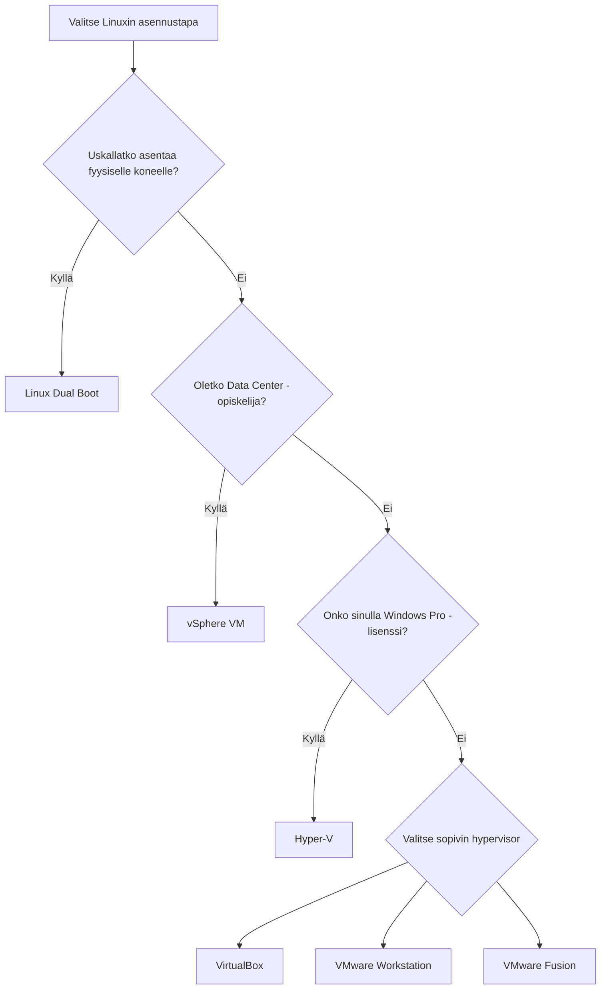

# Aloita tästä

## Luvun tehtävät

Tämän koko luvun *Asennus* tehtävä on poikkeuksellisesti heti alussa. Tämä johtuu siitä, että tarkka asennus riippuu siitä, mitä laitteita sinulla on käytössäsi.

!!! question "Tehtävä: Asenna Ubuntu"

    Valitse sinulle sopivin vaihtoehto Linuxin asennustavoista. Lyhyesti vaihtoehdot ovat:

    * Fyysinen Linux: Dual Boot tai Primary OS
    * Lokaali VM: Oracle VirtualBox, VMware Workstation, Hyper-V
    * DC VM: vSphere

    Näistä neuvotut tavat ovat:
    
    * [Option A: Dual Boot](dualboot.md)
    * [Option B: VirtualBox](virtualbox.md)

    ==Tehtävä on dokumentoida== tämä prosessi oppimispäiväkirjaan. Käytäthän dokumentoinnissa monipuolisesti tekstiä, kuvia, lähteitä, komentoja code blokeissa ja muita tarvittavia elementtejä.

!!! question "Tehtävä: Ubuntu opiskelukuntoon"

    Kun olet saanut Linuxin asennettua ja olet kirjautunut onnistuneesti GNOME-työpöydälle, on aika laittaa Linux opiskelukuntoon. Tämä tarkoittaa, että asennat tarvittavat ohjelmat ja teet tarvittavat asetukset, jotta voit aloittaa opiskelun.

    Tähän löytyy ohjeet dokumentista [Ubuntu opiskelukuntoon](opiskelukuntoon.md).

    ==Tehtävä on dokumentoida== tämä prosessi oppimispäiväkirjaan. Käytä dokumentaatiossa tekstin, lähteiden ja komentojen lisäksi myös kuvakaappauksia. Kuvia asennusprosessista saat kahdella tavalla:
    
    * Ruutukaappaukset: Paina linuxissa näppäimistöltä Print Screen -nappia. Aukeaa ohjelma, jolla voi ottaa kuvakaappauksia.
    * Kännykkäkuvat: Ota kuvia kännykälläsi suoraan näytöltäsi.

## Kuinka valita sopiva tapa?

**Fyysiselle koneelle asentaminen** on oppimisen kannalta suositeltava tapa. Opit opintojen aikana käyttämään Linuxia, jos käytä sitä jatkuvasti - tämä on helpointa, jos se on asennettuna suoraan koneellesi, ja käytät sitä ==päivittäin opiskeluihisi==. Jos koet ylitsepääsemätöntä epävarmuutta tämän suhteen, seuraavaksi suositelluin metodi on asentaa Linux virtuaalikoneeseen.

Alla miellekartta, joka auttaa sinua valitsemaan itsellesi sopivan tavan asentaa Linux.

Mikäli sinulla on jokin yllä mainituista poikkeava tilanne, ota yhteyttä opettajaan. Kurssin voi mahdollisesti suorittaa esimerkiksi Azure-virtuaalikoneella tai WSL2-ympäristön avulla. Tähän tarvitsee kuitenkin erikseen luvan.

!!! warning

    Data center -opiskelijat ovat ainoita, joilla on riittävät oikeudet luoda VMwaren vSphereen virtuaalikone. Mikäli et ole DC-opiskelija, unohda tämä vaihtoehto.

