!!! warning DISCLAIMER

    Sinä kannat kaiken vastuun, mikäli päätät ryhtyä tähän prosessiin. Dual boot on opiskeluiden kannalta hyvä, mutta käyttöjärjestelmän asennukseen liittyy luontaisesti riskejä. Ethän tee tätä esimerkiksi tietokoneelle, jossa on perheenjäsenten Windows-tilien takana tärkeitä tiedostoja. Älä myöskään tee tätä tietokoneelle, jonka olet saanut yritykseltä tai oppilaitokselta käyttöön siten, että heidän IT-osasto hallinnoi sinun konettasi. Jatka tämän ohjeen lukemista vain jos olet asentamassa tätä omalle, henkilökohtaiselle tietokoneellesi, ja olet varannut aikaa mahdollista Windowsin uudelleenasennusta tai muuta vianselvittelyä varten.

## Esivaatimukset

* **Toinen tietokone**. Saatat joutua etsimään ohjeita tai apua kesken asennuksen. Voi esimerkiksi käydä siten, että Wifi-adapterisi ajurit eivät asennu ongelmitta, joten et pääse Internetiin Ubuntusta käsin. Vianselvityksessä auttaa, mikäli sinulla on toinen tietokone.
* **Kärsivällisyyttä**. Varaudu siihen, että asennukseen menee vähintään tunti, vaikka kaikki menisi kerralla nappiin. 
* **Tyhjä USB-tikku.** Kokoa tulisi olla vähintään 8 GB. Vaihtoehtoisesti myös Compact Flash -kortit ja vastaavat saattavat toimia, mikäli koneessasi on kortinlukija.
* **Varmuuskopio kaikesta**. Sinulla tulee olla (henkinen) valmius siihen, että saatat joutua asentamaan Windowsin uusiksi, jos pahin katastrofi iskee.
* **Tilaa asennusta varten**. Valitse seuraavista asennusvaihtoehdoista yksi:
    * **Option A**: C-asemalla (tai vastaavalla) on **ylimääräistä tilaa** josta voit luopua.
    * **Option B**: Sinulla on ylimääräinen, **käyttämätön SSD-levy**, jonka voit luovuttaa Ubuntun käyttöön.

??? tip "Lisäksi mielellään myös ..."

    * **Emolevyn ohjekirja**. Saatat joutua piipahtaa UEFI-asetuksissa ja/tai vaihtaa boot-järjestystä. Tätä varten sinun tulee selvittää, mikä pikanäppäin sinun järjestelmässäsi toimii.
    * **Microsoft Account -tunnukset**. Secure Boot ja/tai BitLocker saattaa huolestua asennusprosessista. Jos saat tähän liittyvän varoitusruudun, älä painokoi. Noudata ruudulla näkyviä ohjeita. Saatat joutua esimerkiksi kirjautumaan Microsoft Accountiin ja näpyttelemään ruudulla näkyviä koodeja palveluun.
    * **Muistiinpanovälineet**. Kannattaa dokumentoida kaikki tekemäsi vaiheet. Ota kuvia ja/tai kirjoita memoa. Tästä voi olla apua mahdollisessa vianselvityksessä.
    * **Verkkokaapeli**. Mikäli koneessasi on tavallinen Ethernet-portti, saattaa verkkokaapeli osoittautua hyödylliseksi, mikäli sinulla on ongelmia Wifi-adapterin ajureiden kanssa.

## Lyhyt ohje

### Ohjeet tueksi

Mikäli seuraat tätä lyhyttä, kuvatonta ohjetta, voi olla hyödyksi kurkata videolta, miltä vaiheet varsinaisesti näyttävät. Video-ohjeessa ei näytetä Fast Boot -vaihetta, mutta se on selitettynä myöhemmin vaihe-vaiheelta ohjeissa.

Video-ohje ilman Fast Boot -asetuksen disablointia: [How to Dual Boot Ubuntu 24.04 LTS and Windows 10 / 11](https://youtu.be/qq-7X8zLP7g)

### Vaiheet 1-5

Vaiheet 1-5 auttavat sinua pääsemään Ubuntu Installeriin. Myöhemmät vaiheet ovat samat kuin Ubuntua virtuaalikoneelle asennettaessa - pois lukien vaihe, jossa valitaan **"Install Ubuntu alongside Windows Boot Manager"**. Näistä löytyy kuvallinen ohje tämän sivun lopusta.

1. **Lataa** Ubuntu 24.04 LTS amd64 ISO-image [Download Ubuntu Desktop](https://ubuntu.com/download/desktop) -sivulta (6 GB).

2. **Polta ISO-image USB-tikulle**. Tämä hoituu helposti Etcher-sovelluksella: [Balena Etcher](https://etcher.balena.io/). HUOM! Kaikki tikulla oleva data katoaa. Varmista, että tikulla ei ole tärkeitä tiedostoja.

3. **Valmistele osio**. Riippuen mihin asennat:

    1. (Option A:) **Pienennä** (engl. shrink) valitsemaasi NTFS-osiota noudattaen Windows Disk Managementillä (hotkey: Windows + X ja sitten K). Näin kiintolevylle vapautuu osioimatonta tilaa. Arvioi oma tilantarpeesi: riitttääkö 200 GB?
    2. (Option B:) **Asenna** tai identifioi hyödyntämätön **SSD-asema**. Poista mahdolliset osiot Windows Disk Managementillä tai myöhemmin Ubuntun asennusohjelmalla.

4. **Kytke Fast Boot pois päältä**. Asennus saattaa toimia ilman tätä steppiä, mutta kenelläpä elämässä niin kiire olisi, että Fast Boot pitää olla päällä. Mene **Control Panel**, klikkaa katerogian otsikkoa **Hardware and Sound**, klikkaa **Power Options**. Valitse vasemmasta menusta **Choose what the power buttons do**. Klikkaa admin-oikeuksia vaativaa **Change settings that are currently unavailable** nappia. Nyt voit ottaa ruksin pois fast startupista.

    !!! warning "Huom!"

        **Sammuta kone**. Huomaa, että Fast Boot kytkeytyy päälle "after shutdown". Sammuta kone kokonaan. Ei siis Restart vaan Shutdown.

5. **Käynnistä USB-tikulta**. Tähän on monta tapaa, mutta me noudatamme Windowsin menujen kautta Windows Recovery Environmentiin menoa. Avaa **Settings** (Windows + x, sitten n), valitse vasemmalta **System** ja avautuvasta listasta **Recovery**. Klikkaa **Advanced startup** -kohdasta **Restart now**. Pääset Windows Recovery Environmentiin. Jos luomasi USB-tikku ei ole USB-portissa, laita se USB-porttiin. Valitse **Use a Device**. Valitse USB-tikkusi listalta.

### Vian selvitys

Etkö päässyt Ubuntu Installeriin asti? Alla olevassa laatikossa on pari vaihtoehtoa vian selvitykseen. Huomaa, että Linuxia opetellessa omatoimisuus on valttia. Jos et pääse eteenpäin, kysy rohkeasti apua kanssaopiskelijoilta, käytä hakukonetta ja käytä jopa ChatGPT:tä tai vastaavaa kielimallia apuna. Muista dokumentoida kaikki kokeilemasi korjausyritykset.

??? tip "Vian selvitys"

    Mahdollisia vikakorjauksia tämän jälkeen ovat esimerkiksi:

    **Kone käynnistyy väkisin Windowsiin?** 
    
    Jos Ubuntu ei käynnisty USB-tikulta, eli et pääse GRUB-menuun valitsemaan "Try or install Ubuntu" vaan kone käynnistyy Windowsiin, niin käynnistä kone uusiksi tavallisesti. Kun UEFI-menut vilisevät ruudulla, noudata emolevysi ohjekirjan tai ruudulla näkyvien neuvojen ohjetta päästäksesi Boot Menuun. Yleensä tämä vaatii F2, F10, F12, Del tai jonkin muun näppäimen painamista lähes välittömästi koneen käynnistymisen jälkeen. 
    
    Mikäli F2 ja muut näppäimet eivät päästä sinua UEFI-menuun, voit navigoida sinne Windowsin kautta. Mene Windows Recovery Environmentiin (kuten vaiheessa 5) ja valitse Troubleshoot => Advanced Options => UEFI Firmware Settings => Restart.

    Kun olet päässyt UEFI-menuun, etsi "Boot order". Vaihda USB-tikku ensimmäiseksi. Tallenna ja poistu. Koneesi pitäisi nyt käynnistyä USB-tikulta. Tarvittaessa lue emolevysi ohjekirjasta lisää. UEFI-menu on emolevystä riippuen erilainen.

    **Secure Boot vastustaa?** 
    
    Jos saat "The Secure Boot key you've entered is not valid."-tyylisiä valituksia ja Ubuntu-asennus keskeytyy, mahdollisia korjauksia ovat:

    * **Ehdotus 1:** Valitse Ubuntun asennuksessa, että älä asenna kolmannen osapuolen ajureita. Asenna nämä myöhemmin itse.

    * **Ehdotus 2:** Kytke UEFI:n Secure Boot esimerkiksi "Other OS"-tilaan, jos vakiona on Windows.

    * **Ehdotus 3:** Kytke Secure Boot pois päältä UEFI-menusta. Asenna Ubuntu. Tämän jälkeen sinun tulisi voida kytkeä Secure Boot takaisin.
  
    **Bitlocker vastustaa.** 
    
    Jos saat Bitlocker-avaimen kyselyitä, noudata ruudulla näkyviä ohjeita. Saatat joutua kirjautumaan Microsoft Accountiin ja näpyttelemään ruudulla näkyviä koodeja palveluun. Ubuntun dokumentaatiosta löytyy myös ohjeita tähän: [(Additional) Installing Ubuntu alongside Windows with BitLocker](https://ubuntu.com/tutorials/install-ubuntu-desktop#13-additional-installing-ubuntu-alongside-windows-with-bitlocker)

    **Intel RST (RAID)**
    
    Intel Rapid Storage Technology tai muut RAID-tekniikat saattavat aiheuttaa ongelmia Ubuntun asennuksessa. Jos saat virheilmoituksia, selvitä ohjeiden avulla, kuinka saat AHCI-ajurit käyttöön rikkomatta Windows-asennustasi. Yksi vanhahko ohje on [SOLUTION: Switch Windows 10 from RAID/IDE to AHCI operation](https://triplescomputers.com/blog/uncategorized/solution-switch-windows-10-from-raidide-to-ahci-operation/), mutta se voi hyvin olla yhä pätevä. Muistathan varmuuskopioida tärkeät tiedostosi ennen kuin ryhdyt muuttamaan asetuksia - ja muistathan että kannat vastuun mahdollisista seuraamuksista. 

### Seuraavat vaiheet?

Olettaen, että pääsit nyt Live-CD:ltä ajettavaan Ubuntuun, sinulla pyörii nyt Ubuntu keskusmuistissa! Haluamme kuitenkin asentaa sen kiintolevylle pysyvästi. Asennuksen pitäisi käynnistyä itsestään. Jos ei, klikkaa "Install Ubuntu"-pikakuvaketta ruudun oikeassa alalaidassa. Nyt voit noudattaa samoja ohjeita kuin Ubuntua virtuaalikoneelle asennettaessa. Noudata ruudulla näkyviä ohjeita.

Jos tarvitset ohjeistusta, lue alempaa Vaihe 6 ja eteenpäin.

## Pitkä kuvallinen ohje

Mikäli haluat yllä olevan ohjeen tueksi kuvia, pläräile myös tämä ohje läpi. Huomaa, että vaiheet ovat hyvin samoja kuin yllä linkitetyssä Youtube-videossa. Tässä ohjeessa käytään C-aseman kutistamista. Mikäli asennat erilliselle SSD-levylle, jätä turhat vaiheet (kuten osion kutistaminen) väliin.

### Vaihe 1: Lataa Ubuntu

Mene [Ubuntu.com](https://ubuntu.com/download/desktop) -sivulle ja lataa Ubuntu 24.04 LTS. Valitse 64-bit versiona. Lataus on noin 6 GB.

### Vaihe 2: Polta ISO-image USB-tikulle

Lataa [Balena Etcher](https://etcher.balena.io/) ja polta Ubuntu ISO-image USB-tikulle. Huomaa, että kaikki tikulla oleva data katoaa. Varmista, että tikulla ei ole tärkeitä tiedostoja.

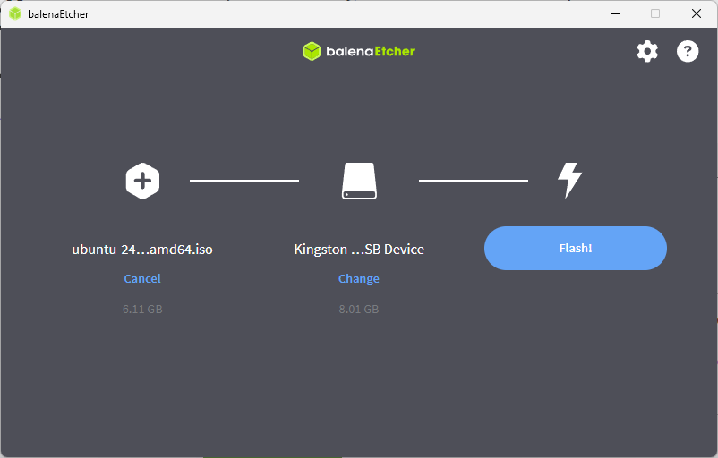

**Kuvio 1:** Balena Etcherin käyttöliittymä. Tarkista huolella, että valittu USB Device on oikea. Kuvan asennuksessa se on toista kymmentä vuotta vanha Kingston DataTraveler 2.0 kokoa 8 GB.

### Vaihe 3: Valmistele osio

Kutista C-asema Windows Disk Managementillä. Klikkaa aloitusmenun Windows-ikonia hiiren oikealla korvalla (tai hotkey ++win+x++) ja valitse "Disk Management". Klikkaa hiiren oikealla C-asemaa ja valitse "Shrink Volume".

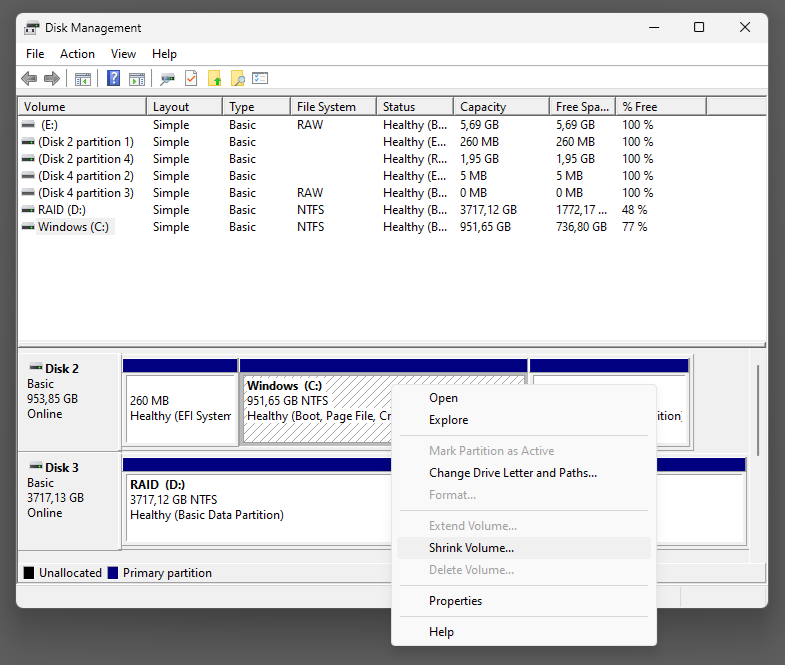

**Kuvio 2:** Disk Managementin kutistus-toiminto löytyy Disk Managementin kontekstivalikosta.

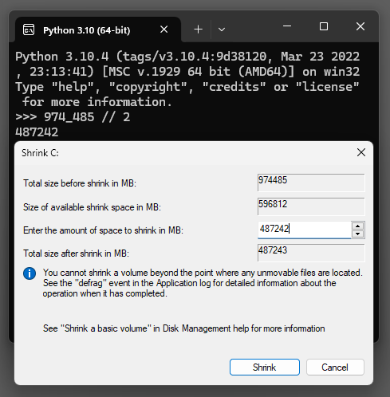

**Kuvio 3:** Valitse kuinka paljon haluat kutistaa C-asemaa. Kuvassa 974485 Mt osio on jaettu kahteen suunnilleen yhtä suureen osioon: 487,243 MB eli noin 476 GB.

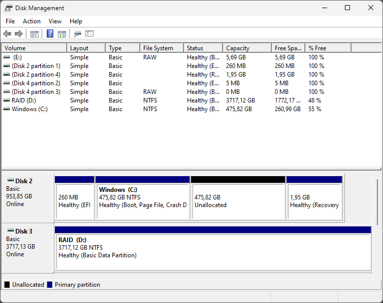

**Kuvio 4:** Disk Managementin näkymä kutistuksen jälkeen. Huomaa, että kutistettu osio on "Unallocated". Kyseistä tilaa ei voi käyttää ennen kuin se on osioitu, jolloin se formatoidaan esimerkiksi ext4-tiedostojärjestelmällä (tai NTFS Windowsin käyttöön).

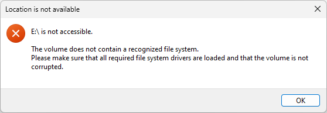

**Kuvio 5:** Windows saattaa varoittaa, että osio on formatoitava ennen käyttöä. Tämä on normaalia. Klikkaa "Cancel" tai "OK" valituksesta riippuen.

### Vaihe 4: Kytke Fast Boot pois päältä

Fast Boot nopeuttaa Windowsin käynnistymistä, mutta aiheuttaa mitä todennäköisemmin ongelmia Ubuntun asennuksessa. Mene **Control Panel**, klikkaa katerogian otsikkoa **Hardware and Sound**, klikkaa **Power Options**. Valitse vasemmasta menusta **Choose what the power buttons do**. Klikkaa admin-oikeuksia vaativaa **Change settings that are currently unavailable** nappia. Nyt voit ottaa ruksin pois fast startupista.

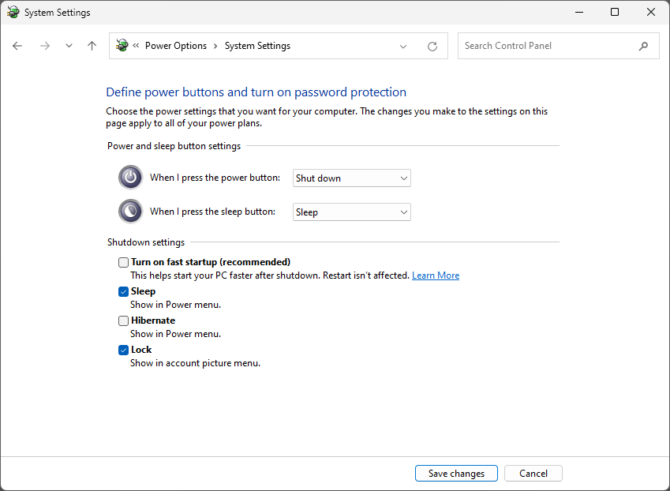

**Kuvio 6:** Fast Bootin poiskytkeminen Windowsin asetuksista.

!!! warning "HUOM!"
    Fast Boot kytkeytyy päälle "after shutdown". Sammuta kone kokonaan. Ei siis Restart vaan Shutdown.

### Vaihe 5: Käynnistä USB-tikulta

Kun käyttöjärjestelmäsi on käynnistynyt uudelleen, mene **Windows Recovery Environmentiin**. Avaa **Settings** (++win+x++), valitse vasemmalta **System** ja avautuvasta listasta **Recovery**. Klikkaa **Advanced startup** -kohdasta **Restart now**. Pääset Windows Recovery Environmentiin. Jos luomasi USB-tikku ei ole USB-portissa, laita se USB-porttiin. Valitse **Use a Device**. Valitse USB-tikkusi listalta.

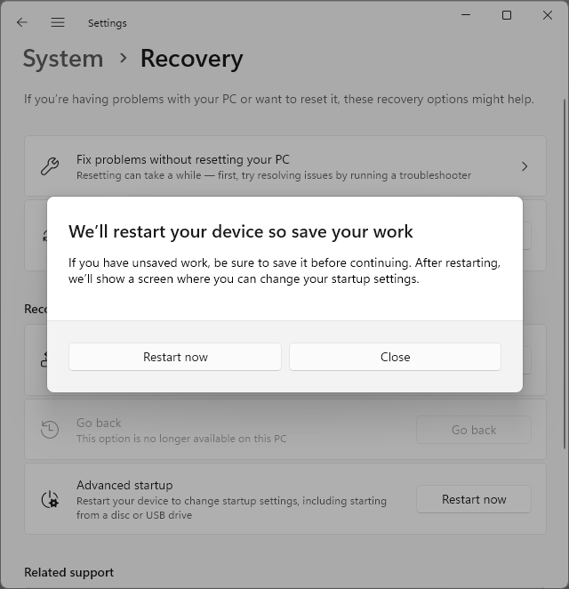

**Kuvio 7:** Kuvassa näkyy pop-up, joka avautuu, kun valitset "Advanced startup"-kohdasta "Restart now".

Tässä välissä tietokoneesi käynnistyy uudestaan ja päädyt Windows Recovery Environmentiin. Valitse **Use a Device** ja valitse USB-tikku.

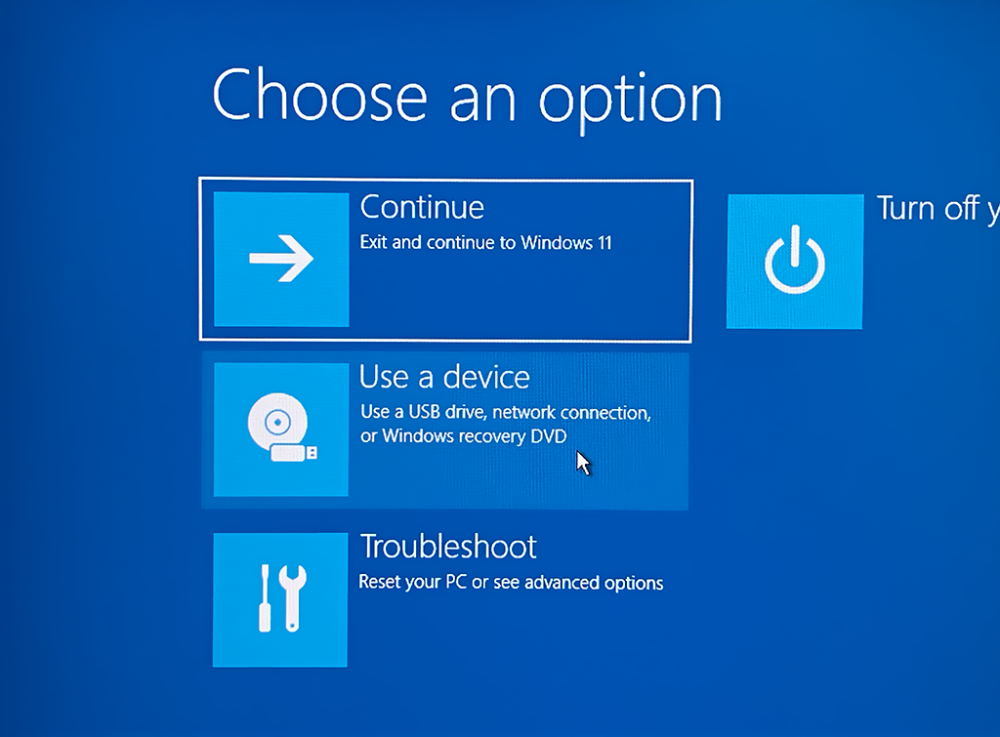

**Kuvio 8:** Kuvassa näkyy Windows Recovery Environmentin "Use a Device" kursorin alla. Valitse tämä.

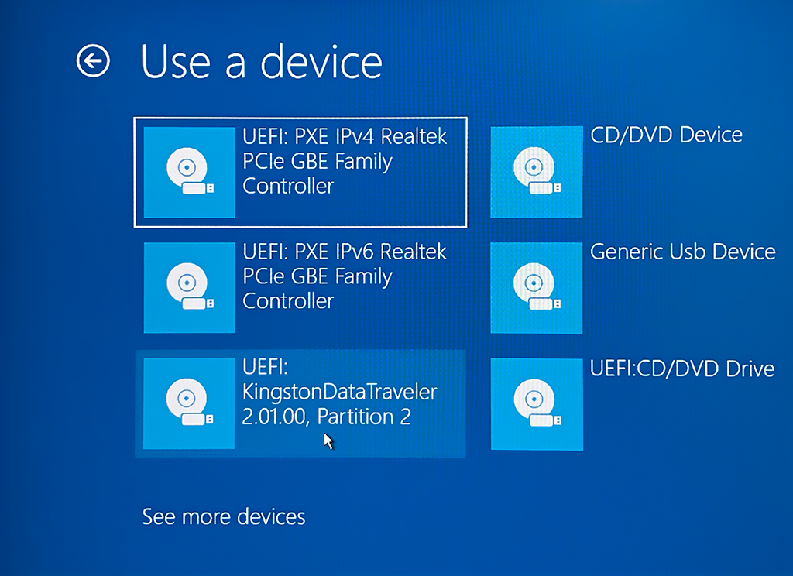

**Kuvio 9:** Valitse USB-tikku, johon poltit Ubuntun.

### Vaihe 6: Käynnistä Live-CD

Kun tietokoneesi käynnistyy tikulta, sinulle pitäisi avautua GBU GRUB Multiboot loader. UEFI on siirtänyt nyt vastuun käynnistyksestä GRUB:lle. Valitse "Try or Install Ubuntu". Tämä käynnistää Ubuntu Live-CD:n, joka on ei-persistentti Ubuntu-asennus. Tämä tarkoittaa, että kaikki muutokset katoavat, kun sammutat koneen. Tätä käytetään Linuxin asentamiseen pysyvästi SSD-levyllesi; jatkossa käynnistät koneesi suoraan SSD-levyltä, mihin asentuu GRUB bootloader sekä itse Ubuntu.

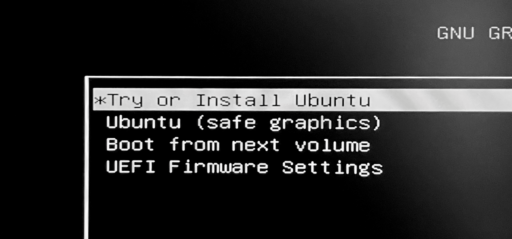

**Kuvio 10:** GRUB Boot Menu. Valitse "Try or Install Ubuntu".

!!! question

    Mikäli et pääse tähän vaiheeseen, katso vianselvitysohjeet ylempää: [Vian selvitys](#vian-selvitys).

!!! tip

    Jos sinulla on joskus ongelmia Linuxin kanssa, voit aina käynnistää Live-CD:n ja käyttää sitä apuna ongelmanratkaisussa. Tämä auttaa esimerkiksi niissä tilanteissa, että olet vahingossa sotknut `/etc/fstab`-tiedoston tai GRUB-konfiguraation `/boot/grub/grub.cfg`.

### Vaihe 7: Asenna Ubuntu

Kun olet päässyt Ubuntu Live-CD:lle, klikkaa "Install Ubuntu" -pikakuvaketta, mikäli asennus ei käynnisty automaattisesti. Asennusohjelma saattaa myös tarjota päivitystä itselleen (eli siis asennusohjelma lataa itsestään uuden version.) Jos näin käy, asennusohjelma sammuu ja sinun tulee tuplaklikata "Install Ubuntu" -pikakuvaketta uudelleen.

Alla on tyypilliset asennuksen valinnat vaihe vaiheelta. Mikäli haluat nähdä kuvat kaikista vaiheista, voit seurata Ubuntun omaa asennusohjetta alkaen vaiheesta [4. Boot from USB flash drive](https://ubuntu.com/tutorials/install-ubuntu-desktop#4-boot-from-usb-flash-drive).

* **Choose your language**
    * Valitse: English
* **Accessibility in Ubuntu**
    * Klikkaa: Next (paitsi jos tarvitset ko. ominaisuuksia)
* **Select your keyboard layout**
    * Valitse: Finnish
    * Testaa alla olevassa kentässä että ääkköset toimivat.
* **Connect to the internet**
    * Suositus: Kytke verkkokaapeli kiinni. Valitse Use wired connection.
    * Vaihtoehto: Käytä wifiä.

    !!! note
    
        Riippuen wifi-adapterista saatat joutua säätämään ajureiden kanssa. Hyvässä lykyssä Ubuntun kernel tukee adapteriasi suoraan. Jos ei, valmistaudu etsimään ohjeita netistä. Tämä on yksi niistä tilanteista, jossa toinen tietokone on hyödyllinen.

* **What do you want to do with Ubuntu?**
    * Valitse: Install Ubuntu
* **How would you like to install Ubuntu?**
    * Valitse: Interactive Installation
* **What apps would you like to install to start with?**
    * Valitse: Default selection
* **Install recommanded proprietary software?**
    * Ruksaa päälle: Install third-party software for graphics and Wi-Fi hardware
* **How do you want to install Ubuntu?**

    * Valitse: Install Ubuntu alongside Windows Boot Manager.

    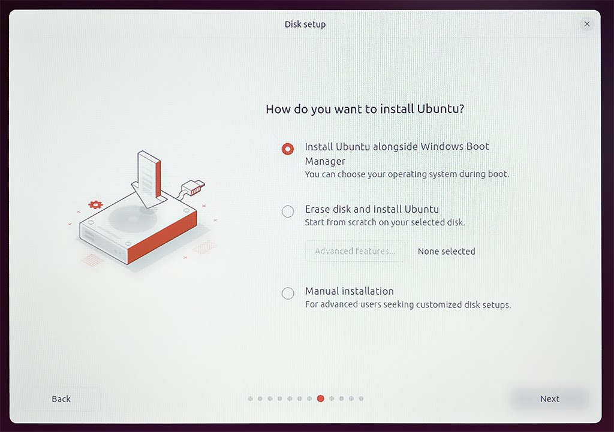
    
    **Kuvio 11**: Valitse "Install Ubuntu alongside Windows Boot Manager".

    !!! warning

        **Älä valitse** "Erase disk and install Ubuntu". Tämä tuhoaa kaiken Windowsin datan. Sen sijaan "Manual installation" voi olla hyvä valinta, jos haluat tarkemmin määritellä osiot. Tämä on kuitenkin edistyneempi vaihtoehto eikä pitäisi olla tarpeen, mikäli luet tätä ohjetta.

* **Create your account**
    * Your Name: Etunimi Sukunimi
    * Your computer's name: Valitse jokin nimi koneellesi tai luota generoituun nimeen.
    * Your username: [a-z] ja [0-9] -merkkejä, esim. sukunimesi pienellä.
        * Esimerkiksi: `sourander`
    * Choose a password: Valitse vahva salasana.
      
        !!! tip "Hyvä salasana"

            Hyvä salasana on pitkä, vaikeasti arvattava ja sisältää erikoismerkkejä - mutta kuitenkin kohtalaisen helppo kirjoittaa. Joudut kirjoittaa salasanaa aika-ajoin uudestaan: aina sisäänkirjautuessa ja silloin tällöin ajaessasi `sudo`-komentoja.

        !!! warning

            Ethän unohda salasanaasi! Laita se talteen salasananhallintaohjelmaan tai muuhun turvalliseen paikkaan.
    * Password: Kirjoita salasana uudelleen.
    * Ruksaa päälle: Require my password to log in
* **Choose your Location**
    * Location: Helsinki tai vaikka Kajaani
    * Timezone: Europe/Helsinki
* **Review your choices**
    * Tarkista asetukset.
    * Klikkaa: Install

### Vaihe 8: Käynnistä kone uudelleen

Kun asennus on valmis, se tarjoaa mahdollisuutta käynnistää kone uudelleen. Klikkaa "Restart Now". Kun kone käynnistyy uudelleen, sinua pyydetään irrottamaan asennusmedia. Irrota USB-tikku ja paina Enter.

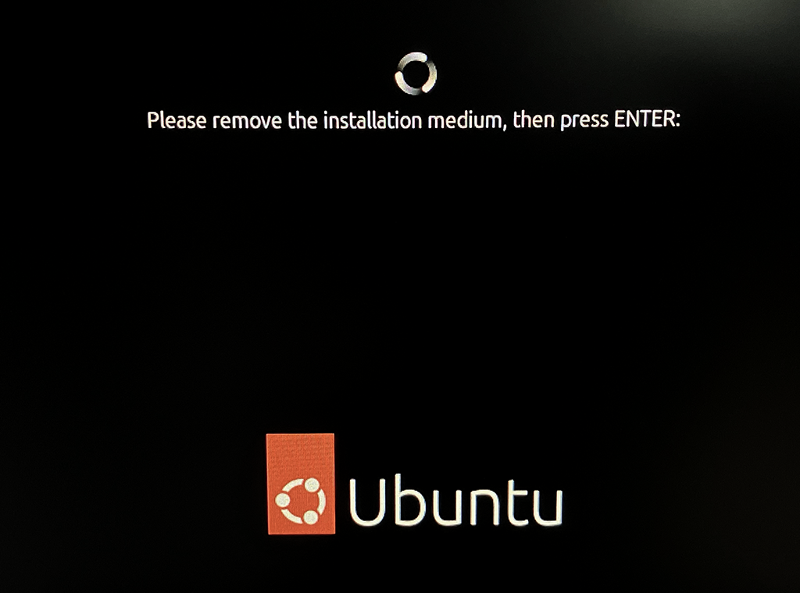

**Kuvio 12:** Irrota asennusmedia ja paina Enter.

Kirjaudu Ubuntuun sisään käyttäen juuri luomaasi käyttäjätunnusta ja salasanaa. Onnea, olet nyt asentanut Ubuntu 24.04 LTS:n Windowsin rinnalle!

### Vaihe 9: Kokeile Ubuntuun ja Windowsiin käynnistystä

Varmista vielä, että pääset yhä Windowsiin. Kun sammutat ja käynnistät koneesi uudestaan, sinulle pitäisi avautua GRUB-valikko, jossa voit valita käynnistetäänkö Ubuntu vai Windows (eli Windows Boot Manager). Käynnistä kone toistamiseen uusiksi ja kokeile, että pääset kumpaankin käyttöjärjestelmään.

GRUB-menu käynnistyy olettaen että se on UEFI-asetuksissa ensimmäisenä boot-optiona. Mikäli GRUB-menu ei avaudu, sinun tulee mennä UEFI-asetuksiin ja valita GRUB bootloader ensimmäiseksi. UEFI-menuun pääseminen on neuvottu aiemmin vaiheessa 5.

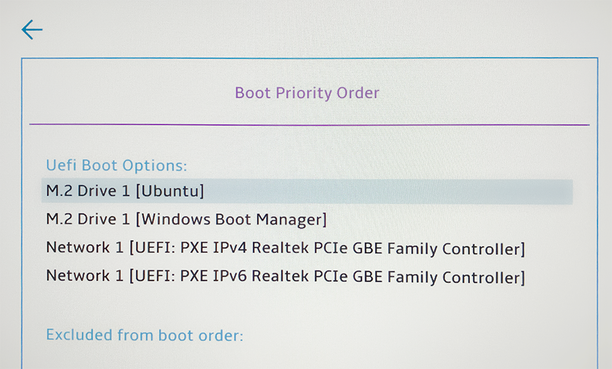

**Kuvio 13:** UEFI Boot Order. Valitse GRUB bootloader ensimmäiseksi. Huomaa, että UEFI-menu on erilainen jokaisessa emolevyssä. Sinun näkymäsi voi poiketa tästä kuvasta hyvinkin merkittävällä tavalla.

## Kuinka päästä eroon Ubuntusta?

Jos haluat joskus luopua dual bootista, vaiheet ovat hyvin tiivistetysti seuraavat:

1. Vaihda UEFI-asetuksista Windowsin boot-järjestys ensimmäiseksi (ks. Kuvio 13).
2. Kirjaudu Windowsiin.
3. Poista Ubuntun luomat osiot Windows Disk Managementillä.
4. Laajenna (engl. extend) Windowsin osio takaisin alkuperäiseen kokoon.
5. Siirry Windows Recovery Environmentiin ja käynnistä sieltä Command Prompt.
6. Kirjoita `bootrec /fixmbr` ja paina Enter.

Jos vaiheet 5-6 eivät onnistu, tarvitset Windowsin asennusmedian (eli USB-tikun jolle on poltettu Windowsin asennusmedia). Käynnistä kone Windowsin asennusmedialta ja etsi menuista "Command prompt". Aja komento kohdasta 6.

Äärimmäisempi vaihtoehto on vetää koko levy sileäksi ja asentaa Windows uusiksi. Tämä onnistuu Windows-asennusmedian avulla.