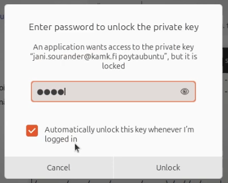

# Lopuksi: Ubuntu opiskelukuntoon

!!! warning

    Tämä ohje on tällä hetkellä aikansa nähnyt. Tilalle tulee yksinkertaisempi ohje, jossa on käytössä Dockerilla ajettu uv, joka pohjustaa cookiecutterin.

Tämän ohjeen tarkoitus on auttaa sinua pika-asentamaan tarvittavat ohjelmat siten, että voit työstää oppimispäiväkirjaa Linuxista käsin. Pohjaoletus on, että sinulla on Ubuntu jo asennettuna. Mikäli sinulla ei ole aiempaa Linux-kokemusta, ohjeen komennot saattavat tuntua osittain heprealta. Kannattaa palata tähän materiaaliin kurssin lopuksi: todennäköisesti huomaat, että ohjeissa ei ole mitään, mitä et osaisi tehdä itsenäisesti, ohjelmien omia dokumentaatioita seuraamalla.

## Video-ohjeet

<iframe width="560" height="315" src="https://www.youtube.com/embed/GFq3KpAREWg?si=aSEjkqUGbQl6bAQi" title="YouTube video player" frameborder="0" allow="accelerometer; autoplay; clipboard-write; encrypted-media; gyroscope; picture-in-picture; web-share" referrerpolicy="strict-origin-when-cross-origin" allowfullscreen></iframe>

**Video 1:** Linux Perusteet 2025 kurssin ohjelmien asennusohjeet.

Yllä on upotettuna Youtube-video, jossa freesiin Ubuntu-asennukseen suoritetaan kaikki tämän ohjeen merkittävät vaiheet. Alla on tekstimuodossa lähes identtiset vaiheet sisältävä ohje. Voit valita, kumpaa haluat seurata - tai tutustutko kumpaankin.

!!! warning

    Huomaa, että videon kohdasta "Docker Engine" jäi uupumaan Rootless Moden asennus. Se paikataan hieman myöhemmin ajassa 27 minuuttia. Eroa kirjoitettuun ohjeeseen on myös siinä, että ensimmäistä oppimispäiväkirjaa ei koskaan kirjoiteta, eikä sisältöä pusketa myöskään Gitlabiin.

## Tekstiohjeet

### Vaihe 1: Git

Avaa Terminal (gnome-terminal) eli pseudoterminaali. Tämä onnistuu monella eri tavalla:

* Pikanäppäin ++ctrl+alt+t++
* Hiiren oikealla korvalla työpöydän tyhjällä alueella ja valitsemalla "Open Terminal"
* Klikkaa ++win++ -näppäintä ja kirjoita hakukenttään "Terminal" ja paina enter.
* Avaa ruudun vasemmasta alalaidasta "Show Apps" ja kirjoita hakukenttään "Terminal" ja paina enter.

Kun Terminal on auki, aja seuraavat komennot, joskin siten, että korvaat oikeisiin paikkoihin oman nimesi ja oman sähköpostiosoitteesi:
    
```bash title="Bash"
# Upgrade software and install git
$ sudo apt update && sudo apt upgrade
$ sudo apt install git

# Set git configuration
$ git config --global user.name "Your Name"
$ git config --global user.email "your.name@kamk.fi"
$ git config --global pull.ff only
$ git config --global init.defaultBranch main
```

!!! warning

    Ethän käytä ajamissasi komennoissa `$`-merkkiä. Se on yllä indikoimassa sitä, että komentoa ajetaan Bash-konsolissa tavallisella käyttäjällä. Se ei ole osa komentoa vaan osa promptia

### Vaihe 2: Luo avainpari

Luo avainpari SSH-yhteyksiä varten. Aja alla olevat komennot, mutta korvaa taas omat tietosi oikeisiin paikkoihin. Keksi tietokoneellesi jokin alias, jolla tunnistat avaimen. Esimerkiksi "dell-laptop" tai "hp-laptop" tai "opiskelulappari".

Komento `ssh-keygen` kysyy sinulta muutamia kysymyksiä. Voit jättää käytännössä kaikki tyhjiksi, jolloin se käyttää vakioasetuksia, mutta ==passphrase kannattaa asettaa==. Muuten olet alttiina sille, että joku voi esiintyä sinuna, mikäli avain joutuu vääriin käsiin.

```bash title="Bash"
# Create SSH key pair
$ ssh-keygen -t ed25519 -C "your.name@kamk.fi alias-for-computer"

# Print the public key to terminal (for copying)
$ cat ~/.ssh/id_ed25519.pub
```

### Vaihe 3: Lisää avain GitLabiin

Navigoi osoitteeseen: [gitlab.dclabra.fi](https://gitlab.dclabra.fi/)

1. Kirjaudu sisään
2. Klikkaa omaa etunimen alkukirjainta vasemmassa yläkulmassa
3. Valitse "Preferences"
4. Valitse "SSH Keys"
5. Paina "Add SSH Key"

Liitä avain leikepöydältäsi ja paina "Add Key". Valitse jokin expiraatioaika, esimerkiksi vuoden tai lukuvuoden loppuun asti.

### Vaihe 4: Testaa yhteys ja tallenna passphrase

Tämän jälkeen testaa Terminaalissa yhteys komennolla:

```bash title="Bash"
# Test connection
$ ssh -T ssh://git@gitlab.dclabra.fi
```

Sinulle aukeaa seuraavanlainen pop-up -ikkuna, jossa pyydetään syöttämään avaimen salasana. Syötä valitsemasi passphrase, ==ruksaa päälle "Automatically unlock this key when I'm logged in"== ja paina "Unlock".



**Kuvio 1:** Avaimen salasanan syöttöikkuna.


### Vaihe 5: Asenna Visual Studio Code

Visual Studio Coden voi asentaa useallakin eri tavalla; me asennetaan se App Centeristä. 

1. Avaa App Center
2. Etsi "Visual Studio Code"
3. Asenna se ja avaa se.

!!! question "Miksi VS Code?"

    Käytämme Visual Studio Codea oppimispäiväkirjan kirjoittamiseen. Sitä voi kirjoittaa millä tahansa tekstieditorilla, mutta VS Code on sekä helppokäyttöinen että laajasti käytetty.


### Vaihe 6: Asenna Docker Engine

Tässä ohjeessa ei asenneta graafista Docker Desktop -ohjelmaa, vaan Docker Engine. Kannattaa noudattaa Dockerin omia, ajan tasalla olevia ohjeita. Näistä tärkeimmät ovat [Install Docker Engine on Ubuntu](https://docs.docker.com/engine/install/ubuntu/) ja [Run the Docker daemon as a non-root user (Rootless mode)](https://docs.docker.com/engine/security/rootless/).

Säästämme hieman aikaa ajamalla *convenience scriptin*, joka ajaa meidän puolestamme tarvittavat komennot.

```bash title="Bash"
# Install prerequisites
sudo apt install curl

# Save the script as get-docker.sh
curl -fsSL https://get.docker.com -o get-docker.sh

# Dry-run the script to to see what commands it will run
sudo sh ./get-docker.sh --dry-run
```

Yllä ajettu *dry run* on alalla yleinen termi sille, että skripti ajetaan siten, että se tulostaa mitä se tekisi, mutta ei tee sitä. Kyseessä on siis simulaatio. On äärimmäisen suositeltavaa kirjoittaa komennon tuloste oppimispäiväkirjaasi: voit kurssin aikana tutustua siihen, mitä ajetut komennot tekevät. Kurssin lopussa sinun tulisi voida täysin ymmärtää jokainen rivi.

```bash title="Bash"
# Run the script
sudo sh ./get-docker.sh

# Remove the script
rm get-docker.sh
```

Nyt voit testata Dockerin toimivuuden komennolla:

```bash title="Bash"
# Tarkista että komento löytyy
# Jos ei, sulje terminaali ja avaa uusi
docker --version

# Hello World!
sudo docker run hello-world
```

!!! warning

    Huomaa, että komento vaati "sudo"-alun. Tähän löytyy hätäinen fix, joka on lisätä oma käyttäjä Docker-ryhmään. Dockerin suosittelema tapa on rootless mode. Tällöin Docker ei vaadi sudo-oikeuksia, mikä lisää järjestelmäsi turvallisuutta, kun ajat tuntemattomia kontteja.

### Vaihe 7: Tee Dockerista Rootless

Aktivoi rootless mode, jotta et jatkossa tarvitse sudo-oikeuksia Docker-konttien ajoon.

```bash title="Bash"
# Install prerequisites
sudo apt install uidmap

# Disable daemon
sudo systemctl disable --now docker.service
sudo systemctl disable --now docker.socket

# Delete socket file
sudo rm /var/run/docker.sock

# Run a script
dockerd-rootless-setuptool.sh install

# Add DOCKER_HOST environment variable to startup script
echo "export DOCKER_HOST=unix:///run/user/${UID}/docker.sock" >> ~/.bashrc

# Daemon should be enabled and running, but let's make sure
systemctl --user enable docker.service
systemctl --user start docker.service
```

??? bug "Kuinka peruuttaa tämä?"

    Jos sinulle ilmaantuu syy ajaa Dockeria `root`-käyttäjänä eli **Rootful-moodissa** – keksin sanan juuri itse –, voit peruuttaa tämän vaiheen muutokset alla näkyvien komentojen avulla. Mikä tällainen syy voi olla? Esimerkiksi Dev Containers, Nokia Containerlab tai jokin DevOps-kurssi, jonka olet aloittanut netissä, tai jokin muu himmeli, joka vaatii Dockerin ajamista `root`-käyttäjänä.

    ```bash title="Bash"
    # Apuskriptillä poisto (lue tämän output: se neuvoo, kuinka voit tuhota halutessasi myös datan eli kontit, imaget ja muut)
    dockerd-rootless-setuptool.sh uninstall

    nano ~/.bashrc # tai .zshrc tai mikä shelli sinulla onkaan
    # Kommentoi seuraavannäköinen rivi pois, jos löydät moisen:
    # export DOCKER_HOST=unix:///run/user/${UID}/docker.sock

    sudo systemctl enable docker.service
    sudo systemctl enable docker.socket

    sudo groupadd docker
    sudo usermod -aG docker $USER
    ```

    Lopuksi käynnistä kone vielä uudelleen. Tarkista, että `echo $DOCKER_HOST` ei tulosta mitään. Jos tulostaa, etsi, missä tiedostossa se on saanut arvonsa. Olettaen että kyseinen ympäristömuuttuja on asettamatta, niin jatkossa `docker run hello-world` on käytännössä sama kuin `sudo docker run hello-world`. Eli **Rootful**-moodi on käytössä.


### Vaihe 8: Kloonaa kurssin repositorio

Jos et ole vielä alustanut repositorioosi oppimispäiväkirjaa, tee se nyt. Nämä vaiheet neuvotaan myös [Oppimispäiväkirja 101](https://sourander.github.io/oat/)-sivustolla. Aloita luomalla tätä kurssia varten oma hakemisto. Täytä `<kurssin-nimi-tahan-2024>` oikealla kurssinimellä, kuten `linux-perusteet-2025`. Näet tuon Gitlab-urlin namespacesta, esimerkiksi: `https://repo.kamit.fi/linux-perusteet-2025`

!!! note

    Käytä URLia, jonka löydät Reppu Moodlesta tai jonka opettaja on sinulle neuvonut. Älä luo omia repositorioita omatoimisesti, sillä opettaja luo ne skriptillä Moodle-osallistujalistan perusteella. Jos olet hukassa, kysy opettajalta.

```bash title="Bash"
# Create directory for learning diary
mkdir -p ~/Code/kurssin-nimi-tahan-2025/

# Change directory
cd ~/Code/kurssin-nimi-tahan-2025/
```

Seuraavaksi kloonaa oppimispäiväkirjasi repositorio. Tämä on helppoa tehdä kopioimalla Gitlabin ohjeen tarjoamat komennot. Ohjeet löytyvät sinun tyhjästä repositoriostasi, joka on muotoa: `https://repo.kamit.fi/<kurssin-nimi-2024>/<etunimisukunimi>/`. Komennot ==kannattaa ajaa yksitellen==, jotta näet, jos välissä tulee virheitä. Ethän siis kopioi ja liitä kaikkia komentoja kerralla.

??? question "Mistä tunnistaa oikeat ohjeet?"

    Oikeat ohjeet löytyvät sinun tyhjästä repositoriostasi. Ne katoavat, kun pusket ensimmäisen commitin repositorioon. Repositoriossa on kolme eri ohjetta päällekäin. Sinun tarvitsemasi on otsikolla **Create a new repository** eli ylin kolmesta ohjeesta. Alla sen sisältö, joskin väärän urlin kanssa:

    ```bash title="Bash" title="Gitlabin komento"
    git clone $CHECK_YOUR_OWN_URL_FROM_GITLAB
    cd etunimisukunimi
    git switch --create main
    touch README.md
    git add README.md
    git commit -m "add README"
    git push --set-upstream origin main
    ```

### Vaihe 9: Alusta oppimispäiväkirja

Seuraa ohjeita, jotka löytyvät [kamk cookiecutters](https://github.com/sourander/kamk-cookiecutters) repositorion README.md-tiedostosta. Lyhyt vastaus on, että aja seuraava komento ja noudata ohjeita:

```bash title="Bash"
docker run -it --rm \
-v "$(pwd):/workspace" \
-w /workspace \
ghcr.io/astral-sh/uv:python3.11-bookworm \
uvx cookiecutter gh:sourander/kamk-cookiecutters -f
```

!!! tip

    Liitä yllä oleva komento leikepöydälle *Code copy button*:n avulla, joka on koodisnippetin oikeassa yläkulmassa. Se on kuvake, jossa on kaksi paperia päällekkäin. Näin saat komennon kopioitua ilman mahdollisia näkymättömiä merkkejä kaikkine kenoviivoineen ja rivivaihtoineen.

### Vaihe 10: Ensimmäinen oppimispäiväkirjamerkintä

Avaa oppimispäiväkirja, eli nykyinen kansio, Visual Studio Codessa. Tämä onnistuu helposti komennolla:

```bash title="Bash"
code .
```

Tämän jälkeen toimi Visual Studio Codessa, kuten muilla kursseilla on opetettu. Jos et ole käyttänyt Visual Studio Codea aiemmin, kannattaa tutustua [Oppimispäiväkirja 101](https://sourander.github.io/oat/) -sivuston ohjeisiin. Sieltä löytyy myös videomuotoinen ohje oppimispäiväkirjan alustamiseen ja merkintöjen kirjoittamiseen.


### Vaihe 11: Aja oppimispäiväkirja

Aja oppimispäiväkirja komennoilla, jotka neuvotaan `HOW-TO-DOCS.md`-tiedostossa. Tämä tiedosto löytyy oppimispäiväkirjasi juuresta. Lyhyt vastaus on, että aja komento:

```bash title="Bash"
# Run docker compose project
docker compose -f docker-compose-docs.yml up -d
```

Avaa nettiselain, esimerkiksi Firefox, ja navigoi osoitteeseen `http://localhost:8000`. Siellä pitäisi olla oppimispäiväkirjasi.

### Vaihe 12: Muista versionhallinta!

Kun olet tehnyt ensimmäisen merkintäsi oppimispäiväkirjaan, puske muutokset Gitlabiin. Tämä neuvotaan toisilla kursseilla, mutta on lyhyimmillään:

```bash title="Bash"
git add .
git commit -m "First learning diary entry"
git push
```

### Vaihe 13: Tarkista GitLab Pages

Käy GitLab:n sivuilla sinun repositoriosi GitLab Pages -osiossa. Sieltä löytyy linkki sinun oppimispäiväkirjaasi.
