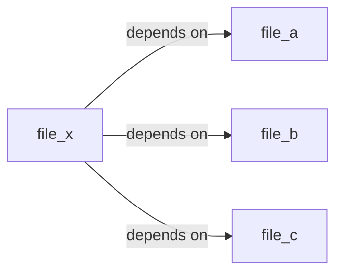

# Modularisointi

Tähän asti kaikki esimerkit ovat sijainneet yhdessä C-tiedostossa. Tämä ei ole kovin käytännöllistä, jos ohjelma on suuri. Tässä tulevat apuun header-tiedostot sekä *build system* nimeltään `make`.

## Simppeli esimerkki

Lue tiedostot `headerdemo.c` ja `headerdemo.h`. Lisää tiedostoihin sisältö alla näkyvästä koodista.

Tiedostojen kuvaus:

* `app_itself.c` on ohjelma itse. 
* `headerdemo.h` sisältää `printHello`-funktion prototyypin (declaration).
* `headerdemo.c` sisältää `printHello`-funktion toteutuksen (definition).

### Koodi

=== "app_itself.c"
    
    ```c
    #include "headerdemo.h"

    int main() {
        printHello();
        return 0;
    }
    ```

=== "headerdemo.c"

    ```c
    #include "headerdemo.h"
    #include <stdio.h>

    void printHello() { printf("Hello, World!\n"); }
    ```

=== "headerdemo.h"

    ```c
    void printHello();
    ```

!!! tip "Miksi <> merkit?"

    Huomaa lokaalin ja toisesta polusta löytyvän header-tiedoston ero. Lokaali header-tiedosto on sijoitettu lainausmerkkien sisään, kun taas toisesta polusta löytyvä tiedosto on sijoitettu kulmasulkeiden sisään.

    Jos haluat löytää `stdio.h`-tiedoston, jota GCC käyttää, voit ajaa seuraavan komennon:

    ```bash title="Bash"
    gcc -E -x c - -v < /dev/null
    ```

    Etsi outputista rivejä, jotka näyttävät tältä:

    ```bash title="Bash"
    #include <...> search starts here:
    /usr/lib/gcc/aarch64-linux-gnu/11/include
    /usr/local/include
    /usr/include/aarch64-linux-gnu
    /usr/include
    ```

    Tulet löytämään esimerkiksi tiedostot:
    
    * `/usr/include/stdio.h` (ASCII)
    * `/usr/lib/aarch64-linux-gnu/libc.so` (ASCII)
    * `/usr/lib/aarch64-linux-gnu/libc.so.6` (ELF)

    Yllä mainittu `.so`-tiedosto on dynaaminen kirjasto, joka sisältää koodia, jota voidaan ajaa ohjelman suorituksen. Windowsissa sen vastine on DLL-tiedosto.

### Kääntäminen

Koodi käännetään aivan kuten ennenkin, mutta sinun tulee listata kaikki tarvittavat `*.c`-tiedostot. Käännä ohjelma seuraavasti:

```bash title="Bash"
# Jos hakemistossa ei ole muita .c-tiedostoja
$ gcc *.c -o app_itself

# Jos on, määrittele lista
$ gcc app_itself.c headerdemo.c -o app_itself
```

!!! question "Tehtävä"

    Luo toinen ohjelma, nimeltään **Another App**, joka hyödyntää samaa kirjastoa.

### Objektitiedostot

Ohjelman kääntämisen sijasta voit kääntää kaikki `jotain.c`-tiedostot objektitiedostoiksi. Tästä on se hyöty, että mikäli jatkossa `egg.c` muuttuu, mutta `ham.c` ja `spam.c` eivät, sinun tarvitsee generoida vain `egg.o` uudelleen.

```bash title="Bash"
# Jos hakemistossa ei ole muita .c-tiedostoja
$ gcc -c *.c

# Jos on, määrittele lista
$ gcc -c app_itself.c headerdemo.c
```

??? tip "Miksi -c?"

    `-c`-flagi kertoo GCC:lle, että "Only run preprocess, compile, and assemble steps". Linkitys ja suoritettavan tiedoston luonti jäävät tekemättä.

Hakemistoon luodaan uudet objektitiedostot:

```bash title="Bash"
$ tree
.
├── app_itself.c
├── app_itself.o  <== tämä
├── headerdemo.c
├── headerdemo.h
└── headerdemo.o  <== tämä
```

Jatkossa, kun `headerdemo.c` muuttuu, sinun tarvitsee kääntää vain `headerdemo.o` uudelleen.

```bash title="Bash"
# Käännä
$ gcc *.o -o app_itself
$ ./app_itself
Hello, World!

# Muokkaa headerdemo.c:tä ja käännä uusiksi
$ sed -i 's/World/Humans/' headerdemo.c
$ gcc -c headerdemo.c
$ gcc *.o -o app_itself
Hello, Humans!
```

Säästö on tässä tapauksessa mitätön, koska lähdekoodissa on vain muutama rivi. Tilanne olisi toinen, jos lähdekoodia olisi tuhansia rivejä ja/tai jos käytössä oleva CPU olisi merkittävän hidas.

## Hello Make

Tämä opas on todella lyhyt johdanto Make:n käyttöön. Kannattaa tutustua lisäksi helppolukuiseen [Learn Makefile with the tastiest examples](https://makefiletutorial.com/)-oppaaseen.

### Makefile

```makefile title="Makefile"
file_x: file_a file_b file_c
	@echo "I am being executed!"
	touch file_x
```

!!! tip "Syntaksi"

    ```txt
    target: dependency1 dependency2 ...
        # Komentoja
        # sisennettynä
        # TAB-merkillä
        command_that_builds_target
    ```

    Komento @echo on Makefilen syntaksiin kuuluva "silent"-käsky. Komento `@` estää Makea tulostamasta itse komentoa, mikä on echon kanssa hyödyllistä. Kokeile ajaa Makefilea ilman `@`-merkkiä ja katso mitä tapahtuu.

### Riippuvuudet

Yllä olevan Makefilen mukaan `file_x` riippuu `file_a`, `file_b` ja `file_c`-tiedostoista. Mikäli tämän piirtää graafina, se näyttää tältä:



Makefile on tavallinen ASCII-tekstitiedosto. Komento `make` olettaa hakemistosta löytyvän sen nimisen tiedoston (vtr. `Dockerfile`). Sinulla pitäisi olla  `make` jo asennettuna: se asentuu tyypillisesti `build-essential`-pakettiryhmän mukana. Kun ajat `make`-komennon, se lukee `Makefile`-tiedoston sisällön ja suorittaa komennot, mikäli:

1. `file_x` on vanhempi kuin `file_a`, `file_b` tai `file_c`
2. `file_x` ei ole olemassa

Harjoittele tätä ajamalla seuraavat komennot ajatuksella:

```bash title="Bash"
# Valmistelut: Luo Makefile
# Katso sisältö yltä

# Luo riippuvuudet
$ touch file_a file_b file_c

# Tarkista mitä löytyy.
$ ls -lAtT | awk '{print $8, $10}'
  13:39:25 file_c
  13:39:25 file_b
  13:39:25 file_a
  13:35:50 Makefile

# Aja
$ make

# Tarkista mitä löytyy.
$ ls -lAtT | awk '{print $8, $10}'
  13:42:22 file_x
  13:39:25 file_c
  13:39:25 file_b
  13:39:25 file_a
  13:35:50 Makefile


# Kokeile ajaa uusiksi
$ make
```

Huomaat, että viimeinen `make`-komento ei tee mitään, koska `file_x` on jo olemassa ja se on uudempi kuin `file_a`, `file_b` ja `file_c`. Kokeile vielä muokata `file_a`-tiedostoa ja ajaa `make` uudelleen.

```bash title="Bash"
$ touch file_a
$ make
```

### Useampi target

Jos `Makefile`-tiedostossa on useampi target, `make`-komento ajaa aina ensimmäisen targetin. Voit kuitenkin ajaa muita targetteja seuraavasti:

```makefile title="MyFakeMakefile"
say_hi:
    @echo "Hi"

say_cheese:
    @echo "Cheese"

say_goodbye:
    @echo "Goodbye"
```

```bash title="Bash"
# Aja ensimmäinen target
$ make -f MyFakeMakefile say_hi

# Aja toinen target
$ make -f MyFakeMakefile say_cheese
```

!!! warning

    Huomaa, että mikään yllä mainituista targeteista ei ole olemassa oleva tiedosto, eikä niiden alla oleva komento luo sitä. Nämä targetit ajetaan siis aina.

### Target riippuuvuutena

Targetit voivat olla toisten targettien riipuuvuuksia. Näin riippuuvuuksista tulee puuksi kuviteltava riippuvuuspuu (engl. *dependency tree*).

```makefile title="ImprovedMakefile"
all: say_hi say_cheese say_goodbye

say_hi:
	@echo "Hi"

say_cheese:
	@echo "Cheese"

say_goodbye:
	@echo "Goodbye"
```

```bash title="Bash"
$ make -f ImprovedMakefile
```

!!! question "Tehtävä"

    Tee Makefile-tiedosto, joka kääntää `app_itself`-binäärin, mikäli jokin sen dependenssi on muuttunut. Mieti, millaisen puun nämä riippuvuudet muodostavat:

    * `app_itself.c`
    * `app_itself.o`
    * `headerdemo.c`
    * `headerdemo.h`
    * `headerdemo.o`
