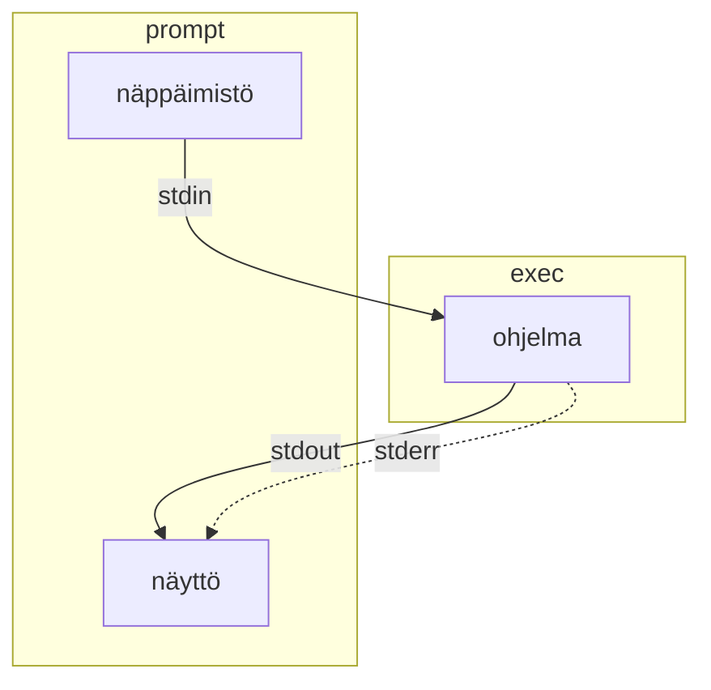
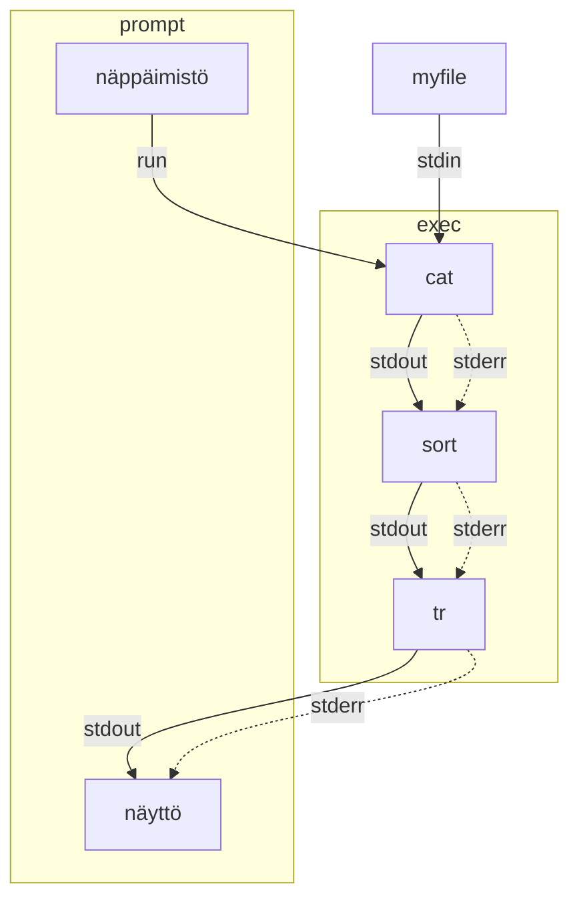

Tyypillinen ohjelma ottaa syötteensä näppäimistöltä tai tiedostosta ja tulostaa palautuvan virran näytölle. Tähän työhön osallistuu kolme eri standardivirtaa:  standardisyöte (**stdin**), standardituloste (**stdout**) ja standardivirhe (**stderr**). Näitä striimejä edustavat luvut 0, 1 ja 2 samassa järjestyksessä.



## Muita lähteitä

Tämän luvun lisäksi sinua saattavat auttaa oppimisessa erilaiset cheat sheetit, kuten:

* [PDF: Bash Redirections Cheat Sheet](https://catonmat.net/ftp/bash-redirections-cheat-sheet.pdf)
* [Bash One-Liners Explained, Part III: All about redirections](https://catonmat.net/bash-one-liners-explained-part-three)

## Uudelleenohjaus

Standardivirtaa voi uudelleenohjata tiedostoihin tai tiedostoista. Kohdetiedosto luodaan jos sitä ei ole olemassa.

| Operaattori  |                                                                                                                                                            |
| ------------ | ---------------------------------------------------------------------------------------------------------------------------------------------------------- |
| `>` tai `1>` | Ohjaa stdoutin tiedostoon.                                                                                                                                 |
| `2>`         | Ohjaa stderrorin tiedostoon                                                                                                                                |
| `&>`         | Ohjaa kummatkin tiedostoon                                                                                                                                 |
| `>>`         | Tekee saman kuin mikä tahansa aiempi `>`, mutta ei kirjoita tiedostoa alusta alkaen vaan jatkaa (eng. append) tiedostoa.                                   |
| `<`          | Tuo stdinputin tiedostosta. Tällöin syntaksi olisi `command < input.txt > output.txt`, mikä on tosin useimmiten sama kuin `command input.txt > output.txt` |
| 2>&1         | Hieman outolintu, joka ohjaa stderrorin sisällön stdoutputtiin. Stdoutput sisältää jatkossa kummatkin.                                                     |

Käytännössä tämä mahdollista muun muassa komennon ajamisen siten, että onnistunut output kirjoitetaan yhteen tiedostoon, errorit toiseen:

```bash title="Bash"
# Stdout ja Stderr eri tiedostoihin
somecommand > success.output 2> errors.log

# Stdout bittiavaruuteen
find / -name ".bashrc" 2> /dev/null
```


## Putket

Standardivirran voi myöhemmin päättää putkittaa (`piping`) käyttäen putkisymbolia (`|`) seuraavalle ohjelmalle. Tarkkaile, mitä alla oleva liuta komentoja tekee:

```bash title="Bash"
$ echo "c" > myfile   # Ylikirjoita
$ echo "b" >> myfile  # Jatka
$ echo "a" >> myfile  # Jatka
$ cat myfile          # Tulosta
c
b
a

$ cat myfile | sort | tr [:lower:] [:upper:] # Järjestä ja kapitalisoi
A
B
C
```

Yllä oleva esimerkki ajaa komennon `cat`, jonka standard output siirtyy `sort` ohjelman inputiksi, jonka standard output siirtyy `tr`-ohjelman inputiksi, ja lopulta sen tuloste palautuu takaisin käyttäjälle. Lopputuloksena on alkuperäinen syöte aakkosjärjestyksessä, kirjaimet vaihdettuna suuriin kirjaimiin. Lisää esimerkkejä löytyy suomeksi täältä: [Standardivirrat – Linux.fi](https://www.linux.fi/wiki/Standardivirrat).

Alla sama graafisena:



!!! question "Tehtävä"

    Selvitä, mitä komento `tee` tekee. Se liittyy standardivirtoihin, mutta kuinka?

## Here document

Here document on tapa syöttää useita rivejä komentoriville. Tämä on hyödyllistä esimerkiksi silloin, kun haluat luoda tiedoston sisällön komentoriviltä. Tämä onnistuu esimerkiksi seuraavasti:

```bash title="Bash"
$ cat > tiedosto.txt << EOF
> Tämä on ensimmäinen rivi.
> Tämä on toinen rivi.
> EOF
```

Lue aiheesta lisää esimerkiksi [Wikipedia: Here document](https://en.wikipedia.org/wiki/Here_document).