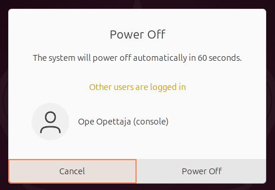
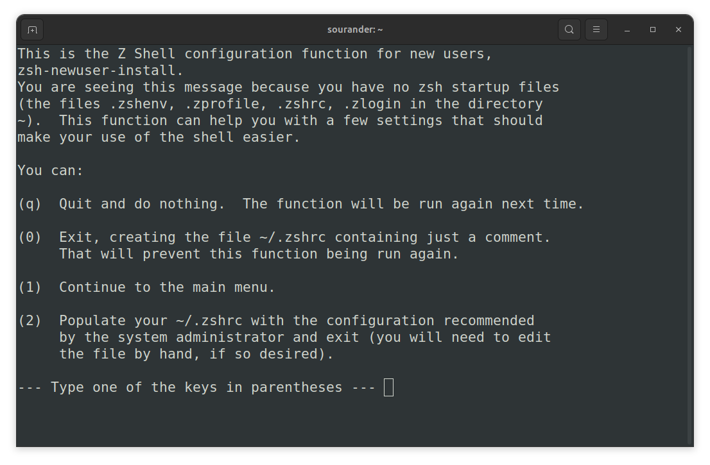

# Terminaali

## Terminologiaa

Linuxia voi käyttää usealla eri käyttöliittymällä. Termistö tulee yllättävänkin kaukaa historiasta, lue koko tarina täältä: [A Guide to the Terminal, Console, and Shell (thevaluable.dev)](https://thevaluable.dev/guide-terminal-shell-console/). Alla sama aihe lyhyemmin suomeksi. 

Kaukokirjoitin (eng. teleprinter), suurimpana valmistaja **t**ele**ty**pe (`=> tty`), oli fyysinen laite, joka koostui näppäimistöstä ja tulostimesta, ja joka lähetti viestin vastaanottajalle esimerkiksi puhelinlankoja pitkin. Viesti tulostettiin paperille. Näitä käytettiin ==jo 1800-luvun lopulla==. Myöhemmin, tietokoneiden aikakaudella eli 1900-luvun puolivälin tienoilla, kaukokirjoittimia (`muista: tty`) käytettiin lähettämään viestejä keskustietokoneisiin (eng. mainframe).

1960-luvulla tulostaminen korvattiin näytöillä, ja näin syntyi videoterminaali, josta käytettiin myös termiä `console` tai lyhyesti `terminal`.

1970-luvulla kaukokirjoittimella tai terminaalilla pystyi lähettämään viestejä UNIX-käyttöjärjestelmään. Lähetetyt viestit kirjoitettiin `/dev/tty0` (tai `tty1` - `tty63`) tiedostoon. Jokaista lähettäjää varten oli oma, juoksevalla numerolla numeroitu tiedosto. Tämä tiedosto toimi rajapintana UNIX:n pään ohjelmille, jotka pystyivät käsittelemään tätä tiedostoa (tai laitetta) tavallisella ASCII-merkistöllä.

Ohjelma, joka tulkitsee `/dev/tty`:n sisältöä, on shell. Alunperin tämä oli UNIX-järjestelmissä `Bourne shell`, mutta avoimen lähdekoodin GNU/Linuxissa se on yleisimmin **Bash** (`Bourne-again shell`). UNIX-tyylisissä järjestelmissä komentirivipohjainen shell on jossain määrin myös ohjelmointikieli, ja se toteuttaa tietyt built-in ohjelmat kuten `cd`, `break`, `continue`, `exec` ja `kill`, kuten [GNU Bashin oma dokumentaatio](https://www.gnu.org/software/bash/manual/html_node/What-is-a-shell_003f.html) kertoo.  Kotitietokoneet alkoivat yleistyä, ja kotitietokoneen kanssa fyysisesti erillinen konsoli eli terminaali ei ole tarpeen, joten se emuloitiin (`terminal emulator`). Näistä emuloiduista terminaaleista käytetään yhä termiä `TTY device`. Komentoja tulkkaava shell, kuten `bash`, lukee tämän virtuaalisen konsolin syötettä `/dev/tty`-tiedostosta.

| Termi                    | Määritelmä                                                                                                                                                                                                                                                                                                                                                                                         |
| ------------------------ | -------------------------------------------------------------------------------------------------------------------------------------------------------------------------------------------------------------------------------------------------------------------------------------------------------------------------------------------------------------------------------------------------- |
| Shell                    | Ohjelma, joka toimii ihmiselle käyttöliittymänä. Mikäli käytät GNOME 3 -työpöytäympäristöä, sinun shell on [GNOME Shell](https://access.redhat.com/documentation/en-us/red_hat_enterprise_linux/7/html/desktop_migration_and_administration_guide/gnome-shell). Mikäli kirjaudut Linuxiin ilman graafista shelliä, sinun shell on todennäköisimmin [GNU Bash](https://www.gnu.org/software/bash/). |
| Komentotulkki            | Englanniksi command language interpreter tai command-line interface, lyhenteeltään CLI. GNU Bash on sekä shell että CLI.                                                                                                                                                                                                                                                                           |
| Graafinen käyttöliittymä | Englanniksi graphical user interface, lyhenteeltään GUI. GNOME Shell on sekä shell että GUI.                                                                                                                                                                                                                                                                                                       |
| Terminaali               | Terminaali on kone - tai yleisemmin virtuaaliterminaali eli ohjelma - jossa shell ajetaan. Konsoli on käytännössä sama asia.                                                                                                                                                                                                                                                                       |
| Pseudoterminaali         | Ohjelma, jota käyttäjä ajaa graafisessa käyttöliittymässä, ja joka emuloi terminaalia. Käytät pseudoterminaalia, kun olet graafisessa käyttöliittymässä ja etsit jostakin kuvakkeen "Terminal".                                                                                                                                                                                                    |

## Eri sortin terminaaleja

### Virtuaaliterminaalit

Et todennäköisesti ole kirjautunut suoraan virtuaaliterminaaliin Bashillä juuri nyt. Mikäli olisit, sinulla ei olisi graafista työpöytäympäristöä vaan Bash aivan koko ruudun leveydeltään. Tällöin voisit tarkistaa `tty`-komennolla, mikä on käyttämäsi virtuaaliterminaalin numero.

```bash title="Bash"
$ tty
/dev/tty3

$ echo $TERM
linux
```


### Pseudoterminaalit

Olet mitä todennäköisemmin GNOME-työpöydällä, joka on siis johonkin `tty#`:ään kiinnittynyt `GNOME Shell`. Sinun varsinainen *shell* on siis graafinen käyttöliittymä. Jos avaat Terminal-sovelluksen, eli `gnome-terminal`, aukeaa pseudoterminaali, joka emuloi terminaalia. Tässä tapauksessa `tty`-komennon tuloste voi olla pettymyksellinen.

```bash title="Bash"
$ tty
/dev/pts/0

$ echo $TERM
xterm-256color
```

### Virtuaaliterminaaliin ja takaisin

Oletetaan, että olet GNOME-työpöydässä. Haluat käydä virtuaaliympäristössä - ja mielellään löytää vielä takaisinkin. Vaihtoehtoja on kaksi:

* Käytä pikanäppäintä ++ctrl+alt+f4++. (tai jokin muu F-näppäin)
* Käytä komentoa `chvt`.

Ennen kuin teet kumpaakaan, tarkista, mitä sessioneita on jo olemassa:

```bash title="Bash"
loginctl
```

```plaintext title="stdout"
SESSION  UID USER     SEAT  TTY  STATE  IDLE SINCE
      2 1000 opettaja seat0 tty2 active no   -    
```

Tässä esimerkissä on vain yksi sessio, joka on aktiivinen - ja näinhän on oletettavaa, jos minä olen ainut koneeseen kirjautunut henkilö. Kyseinen sessio (2) on kiinnitetty tty2:een ja on aktiivinen. Kyseisessä virtuaaliterminaalissa on kiinnittyneenä siis nykyinen GNOME Shell työpöytineen. Kokeillaan vaihtaa johonkin toiseen virtuaaliterminaaliin; tällöin terminaalissa käynnistyy käyttäjän vakioshell eli yleensä Bash. Käytä vaihtamiseen harkintasi mukaan joko pikanäppäinyhdistelmää tai `chvt`-komentoa. Luethan ensin `man chvt`-ohjeet. Ohjeista pääset pois painamalla `q`-näppäintä.


```bash title="Bash"
$ sudo chvt 4  # tai paina ctrl+alt+f4

# HOX! Tässä välissä ruutu muuttuu mustaksi ja sinulle näkyy kirjautumisnäyttö.
# Kirjoita käyttäjätunnus ja sitten salasana.
# Sitten:

$ tty        # Tarkista, olisiko tämä kenties /dev/tty4
$ loginctl   # Tarkista, onko uusi sessio listalla
```

Pääset takaisin alkuperäiseen istuntoon joko ++ctrl+alt+f2++ tai `chvt 2`-komennolla, olettaen, että tty:n numero on 2 kuten minun esimerkissäni. Jos vaihdat johonkin toiseen, luot uusia istuntoja. Huomaa, että jos yrität jatkossa sammuttaa tietokoneen, niin Ubuntu varoittaa, että muita käyttäjiä on järjestelmään kirjautuneena:



**Kuvio 1.** Varoitus *Other users are logged in* ilmaantuu, jos yrität sammuttaa tietokoneen.

!!! tip

    Voit sulkea sessioita `loginctl`-komennolla. Esimerkiksi `loginctl terminate-session 3` sulkee session 3. Ja kuten ehkä arvaat, voit tarkistaa `loginctl`-komennolla sarakkeesta `SESSION`, mikä on minkäkin sessionin ID.

## Bashin peruskäyttö

### Tunnistaminen

Huomaa, että käyttämäsi shell voi olla jokin muu kuin Bash. Voit selvittää yleensä jollain seuraavista komennoista. Komennon käyttö on simppeliä: kirjoita se ja paina ++enter++.

```bash title="Bash"
$ echo $0
bash

$ echo $SHELL
/bin/bash

$ cat /etc/passwd | grep opettaja  # Korvaa omalla käyttäjänimellä
opettaja:x:1000:1000:Ope Opettaja,,,:/home/opettaja:/bin/bash
```

Bashin käyttöohjeen löydät joko distribuution sivuilta [Ubuntu Manpage: bash - GNU Bourne-Again SHell](https://manpages.ubuntu.com/manpages/jammy/man1/bash.1.html) tai komennolla:

```bash title="Bash"
$ man 1 bash # Bashin manuaali (1)
$ man man    # Manuaalin manuaali
```

1. Komento `man` avaa ohjeet pitkiä tekstitiedostoja sivuttavassa ohjelmassa nimeltään `pager`. Lue ohjeet ohjelman tulosteen eli ruudun alalaidasta. 

### Näppärät pikanäppäimet

Alla olevat pikanäppäimet toimivat tyypillisesti Bash:ssä ja sitä vastaavissa shelleissä.

| Klikattavat näppäimet             | Toiminto                                                                                  |
| --------------------------------- | ----------------------------------------------------------------------------------------- |
| ++ctrl+l++                        | Tyhjentää ruudun. Sama kuin komento `clear`.                                              |
| ++tab++                           | Automaattinen täydennys. Tunnistaa sekä kansion tiedostoja että PATH:ssa olevia ohjelmia. |
| ++tab+tab++                       | Tuplaklikkaus. Automaattinen täydennys, joka näyttää useammat vaihtoehdot.                |
| ++ctrl+u++                        | Poistaa kaikki merkit kirjaisimesta vasemmalle. Näppärä tapa tyhjentää rivi plöröstä.     |
| ++up++<br /> ++down++             | Historian kelaaminen. Voit plärät vanhoja komentoja.                                      |
| ++ctrl+left++<br />++ctrl+right++ | Sanojen hyppiminen vasemmalle ja oikealle. Myös ++alt+b++ ja ++alt+f++ tekevät saman.     |


### Vaarallisemmat pikanäppäimet

| Pikanäppäin | Toiminto                                                                                                                                                                                                                                      |
| ----------- | --------------------------------------------------------------------------------------------------------------------------------------------------------------------------------------------------------------------------------------------- |
| ++ctrl+d++  | Virallisesti EOF. Sillä pääsee esimerkiksi `cat`-sovelluksesta ulos, mutta `bash`:ssä käytettynä se on sama kuin kirjoittaisi `exit`.                                                                                                         |
| ++ctrl+c++  | Interrupt-signaali (SIGINT). Lopettaa ohjelman, millä voi pyrkiä tappamaan jumiin jääneen sovelluksen.                                                                                                                                        |
| ++ctrl+z++  | Pysäyttää sovelluksen ja siirtää sen taka-alalle. Ohjelman toistoa voi jatkaa komennolla `fg`. Vaihtoehtoisesti sen voi käydä myöhemmin tappamassa `kill`-komennolla, mikäli se oli jumissa, eikä siitä pääse eroon yllä olevalla SIGINT:llä. |

## Tehtävät

!!! question "Tehtävä: tty"
    
    1. Aja komento `tty` onnistuneesti pseudoterminaalissa.
    2. Aja komento `tty` onnistuneesti virtuaaliterminaalissa.

    Tätä varten sinun tarvitsee joko käyttää ++ctrl+alt+f3++ -tyylisiä näppäinkomentoja tai `chvt`-komentoa. Dokumentoi prosessi ja selitä omin sanoinesi (mutta lähteiden avulla), mitä oikeastaan teit.

!!! question "Tehtävä: Z-Shellin asennus"

    Ubuntu 24.04:ssä saat Zsh:n näin asennetuksi:

    ```bash
    # Update
    sudo apt update && sudo apt upgrade -y

    # Install 
    sudo apt install zsh
    ```

    Tämän jälkeen voit käynnistää Z-shellin. Ensimmäisellä ajokerralla käynnistyy konfiguraatio-ohjelma, joka näkyy kuvassa alla. Käynnistä Z-Shell se komennolla `zsh`.

    

    **Kuvio 1:** *Ohjelma `zsh-newuser-install` luo sinulle käynnistystiedostot. Valitse `0` eli tyhjä konfiguraatio.

    !!! tip

        Huomaa, että Zsh ei käynnistyessään ajaa `.bashrc`-tiedostoa. Jos sinulla on yhä "Hello, world!" -tuloste kyseisessä tiedostossa, et näe sitä tässä shellissä.

    !!! tip

        Huomaa, että Zsh ei ole sinun vakioshell. Tämän voit todentaa komennolla `grep $USER /etc/passwd`. Opit myöhemmin tällä kurssilla, miten vaihdat vakioshellisi.
