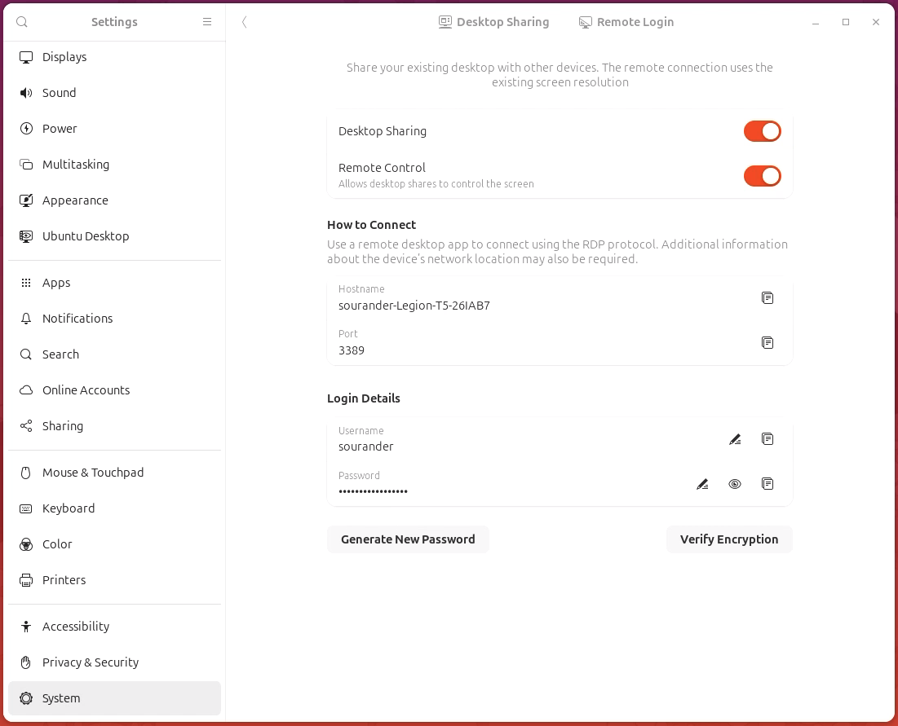

# SSH

Tässä materiaalissa esitellään Linuxin käyttö etänä joko ilman graafista käyttöliittymää tai sen kanssa. 

Etäkäyttö ilman graafista käyttöliittymää suoritetaan Linux-ympäristössä lähes poikkeuksetta ==Secure Shell eli SSH-protokollalla==, joka on Linuxin kernelin tapaan suomalaislähtöinen keksintö. Alunperin 1990-luvun puolivälissä kehitetty SSH korvasi aiemmat merkittävästi vähemmän turvalliset etäkäyttöprotokollat kuten Telnetin. SSH on myöhemmin lisätty RFC-standardiksi ja kuuluu TCP/IP-protokollaperheeseen.

Mikäli tarvitset graafisen käyttöliittymän, niin kohdetietokoneessa tulee olla asennettuna jokin graafinen käyttöliittymä, kuten GNOME tai KDE, usein X Window Systemin päälle. Tällöin grafiikkaa voi siirtää alkeellisimmilla tavoilla kuten X11-forwardingilla, mutta koko työpöytänäkymän siirtäminen vaatii jonkin muun ohjelmiston, kuten RealVNC:n, TeamViewerin tai Chrome Remote Desktopin käyttöä. GNOME itsessään tarjoaa helpon vaihtoehdon: ==GNOME Remote Desktop==. Sen voi käydä klikkaamassa päälle GNOME-asetuksista. Tällöin kommunikointiin käytetään Microsoftin kehittämää RDP-protokollaa.

Mikäli tietokoneesi on julkiverkossa eli Internetissä kiinni, varmista että tietokoneesi ja verkon välissä on palomuuri. Tässä materiaalissa esitellään yksinkertaisen Uncomplicated Firewallin (UFW) käyttöönotto ja SSH-palvelimen suojaaminen UFW:llä. Tietoturvallisuus ei kuitenkaan ole tämän kurssin fokus, joten tätä käsitellään vain pintapuolisesti.

## UFW

UFW on yksinkertainen palomuurisovellus, joka on Debian-pohjaisissa distribuutioissa usein valmiiksi asennettuna. Ethän asenna samaan tietokoneeseen useita eri palomuureja. Huomaa, että palomuurisovellus käyttää alla olevaa low-level palomuuria system call -tasolla eli varsinaisesta palomuurista vastaa Linuxin kernel. Eri sovellukset eri tasoilla ovat:

* High level:
    * UFW (Debian)
    * Firewalld (Red Hat)
* Lower level:
    * nftables (Nouseva korvaaja)
    * iptables (Legacy)
* Kernel level:
    * netfilter

Käytännössä voit siis käyttää suoraan nftables- tai iptables-komentoja, mutta UFW ja Firewalld tarjoavat helpomman käyttöliittymät.

### Asennus

Tee tämä sillä koneella, johon aiot yhdistää - eli "serverillä". Tarkista alkuun, onko UFW asennettuna, aktivoituna ja käynnissä:

```bash title="Bash"
# Onhan aktivoitu?
$ systemctl status ufw
# tai
$ sudo ufw status

# Voit aktivoida sen näin
$ sudo ufw enable

# Tarkista vielä status
$ sudo ufw status
```

??? info "UFW:n asennus"

    Mikäli UFW ei ole asennettuna, asenna se:

    ```bash title="Bash"
    # Asenna UFW
    $ sudo apt update
    $ sudo apt install ufw

    # Aktivoi UFW
    $ sudo ufw enable
    ```

### Sääntöjen lisäys

Lisää palomuuriin säännöt, joiden kuvaus on:

* Defaulttina kiellä kaikki sisääntulevat yhteydet
* Defaulttina salli kaikki ulospäin menevät yhteydet
* Salli sisääntulevat IPv4 TCP-paketit SSH-porttiin 22 sinun lähiverkostasi
* Salli sisääntulevat IPv4 TCP- ja UDP- paketit RDP-porttiin 3389 sinun lähiverkostasi

!!! warning

    Huomaa, että alla oletetaan sinun lähiverkostosi olevan `192.168.0.0/24`. Jos se ei ole, korvaa tämä oikealla verkko-osoitteellasi. Esimerkiksi AVM FritzBoxin oletusverkko on `192.168.178.0/24`. Sinulla voi yhtä hyvin olla lähiverkkona myös `10.0.0.0/8`. Selvitä tämä komennolla `ip route` tai `ip addr`. Jos et ole varma komennon tulosteesta, kysy esimerkiksi ChatGTP:tä tulkkaamaan se sinulle. Tämän pitäisi kuitenkin olla kertausta aiemmista kursseista, joilla on käsitelty tietoliikenneverkkoja.

```bash title="Bash"
# Defaulttina kiellä saapuvat yhteydet (ingress)
$ sudo ufw default deny incoming

# Defaulttina salli lähtevät yhteydet (egress)
$ sudo ufw default allow outgoing

# Salli saapuvat TCP-paketit SSH-porttiin 22 sinun lähiverkostasi
$ sudo ufw allow from 192.168.0.0/24 to any port ssh
```

!!! question "Mistä se tietää mikä on ssh?"

    Käy kurkkaamassa tiedoston `/etc/services` sisältöä. Tämä tiedosto sisältää palveluiden nimet ja niiden portit.

Lisätään myös RDP-portti:

```bash title="Bash"
# Salli saapuvat TCP ja UDP paketit porttiin 3389 sinun lähiverkostasi
$ sudo ufw allow from 192.168.0.0/24 to any port 3389
```

Ufw:ää voi käyttää myös *rate limit* -toimintoon, joka vaikeuttaa brute-force hyökkäyksiä. Ufw rajoittaa yhteydenottojen määrää tiettyyn porttiin tietyn ajan sisällä. Jos salasanatunnistautuminen on pois päältä, brute-force hyökkäykset eivät onnistu, mutta on silti hyvä idea ottaa tämä käyttöön SSH:lle:

```bash title="Bash"
# Ota käyttöön rate limiting SSH:lle
$ sudo ufw limit ssh/tcp comment 'Rate limit for SSH'
```

!!! note "Aloita alusta?"

    Jos olet tyystin sotkenut palomuurin säännöt, voit aloittaa alusta komennolla:

    ```bash title="Bash"
    $ sudo ufw reset
    ```

    Se disabloi UFW:n ja poistaa kaikki säännöt.

## SSH

### SSH Daemon asennus

Tee tämä osio sillä koneella, johon aiot yhdistää. Asenna daemon:

```bash title="Bash"
# Asenna SSH-palvelin
$ sudo apt install openssh-server

# Käynnistä palvelin
$ sudo systemctl start ssh

# Aktivoi palvelin käynnistymään bootissa
$ sudo systemctl enable ssh
```

### SSH Client ensimmäinen yhteys

Ensimmäisellä yhteyskerralla siirrämme client-koneen julkisen avaimen serverille. Tämä tapahtuu komennolla `ssh-copy-id`. Tämä komento kopioi client-koneen julkisen avaimen serverille ja lisää sen `~/.ssh/authorized_keys`-tiedostoon. Tämän jälkeen voit yhdistää serverille ilman salasanaa.

```bash title="Bash"
# Kopioi client-koneen julkinen avain serverille
$ ssh-copy-id user@server
```

!!! question "Esimerkkejä"

    Käytä oikeita käyttäjänimiä ja IP-osoitteita. Voit käyttää myös nimipalvelua, jos reititinmodeemisi tukee sitä. Jos serverisi IP-osoite on `192.168.0.42` ja käyttäjänimesi `akuankka`, niin komento on:

    ```bash title="Bash"
    $ ssh-copy-id akuankka@192.168.0.42
    ```

    Yllä olevassa komennossa on se ärsyttävä puoli, että tietokoneen IP-osoite voi vaihtua. Jotta IP-osoitetta ei tarvitse aina selvittää, voit joko vaihtaa reititinmodeemissasi käyttöön staattisen IP-osoitteen tai voit käyttää reititinmodeemin sisäänrakennettua nimipalvelua, jos reititinmodeemisi tukee sitä. Esimerkiksi Kajaanissa yleinen kaapelimodeemi AVM FritzBox tukee DNS-palvelinta. Tällöin voit käyttää esimerkiksi seuraavaa komentoa:

    ```bash title="Bash"
    $ ssh-copy-id akuankka@tietokoneen-nimi.fritz.box
    ```

Komento kysyy serverin käyttäjän salasanaa. Syötä se ja odota, että komento suoritetaan loppuun. Tämän jälkeen voit yhdistää serverille ilman salasanaa. Tunnistautumiseen käytetään avainparia.

!!! tip "Vaihtoehtoinen tapa"

    Huomaa, että kyseessä on ==julkinen avain==. Komennon `ssh-copy-id` sijasta avain voisi siis yhtä hyvin olla hostattuna verkossa, mistä noutaisit sen. Jos haluaisit sallia opettajan kirjautuvan sinun koneellesi, voisit lisätä sen osoitteesta `https://github.com/sourander.keys`. Tämä tapahtuu seuraavasti:

    ```bash title="Bash"
    # Jos Github
    $ ssh-import-id gh:githubusername

    # Jos jokin muu URL
    $ ssh-import-id url:https://example.com/mykey.pub
    ```

    Tämä komento pitäisi luonnollisesti ajaa **serverillä** eikä client-koneella. Komento kirjoittaa avaimen `~/.ssh/authorized_keys`-tiedostoon.

### SSH Daemon salasanan käytön kieltäminen

Nyt kun yhteys on testattu, voit palata takaisin serverin puolelle ja muokata SSH-daemonin asetustiedostoa. Tämä tiedosto sijaitsee `/etc/ssh/sshd_config`. Huomaa, että voit halutessasi tehdä muutokset drop-in -tiedostoon, joka sijaitsee `/etc/ssh/sshd_config.d/`. Tämä on jopa suositeltavaa.

Salasanan käyttö on lähtökohtaisesti epäsuositeltua. Voit kieltää salasanan käytön muokkaamalla SSH-daemonin asetustiedostoa. Varmista, että seuraava komento on asetettuna alla näkyvällä tavalla. Huomaa, että rivi ei saa alkaa `#`-merkillä; tällöin se olisi kommentti eikä aktiivinen konfiguraatio:

```bash
PasswordAuthentication no
```

Mikäli haluat lisätä turvallisuutta entisestään, voit kytkeä `no`-tilaan myös asetukset: PermitRootLogin, ChallengeResponseAuthentication, UsePAM. Voit tutustua näihin asetuksiin `man 5 sshd_config`-ohjeen avulla.

Tämän jälkeen sinun tulee käynnistää SSH-palvelin uudelleen, jotta muutokset tulevat voimaan:

```bash title="Bash"
# Käynnistä SSH-palvelin uudelleen
$ sudo systemctl restart ssh
# tai
$ sudo systemctl reload sshd.service

# Voit tarkistaa palvelimen asetukset komennolla
$ sudo sshd -T
```

### SSH Client ilman salasanaa

Yhteyden pitäisi yhä pelata, eikä sen pitäisi enää kysyä salasanaa. Testaa yhteys:

```bash title="Bash"
# Korvaa user ja server oikeilla arvoilla
$ ssh user@server
```

!!! tip

    Joskus SSH-yhteyden rivitys voi mennä sekaisin. Tämän voit korjata komennolla: `stty sane` tai `reset`.

## RDP

### Daemon

Ubuntu 24.04:ssä RDP-serverin luominen on äärimmäisen helppoa.



**Kuvio 1.** *GNOME Remote Desktop löytyy Settings > System > Remote Desktop. Aktivoi se ja anna sille uniikki salasana.*

### Client

Teoriassa minkä tahansa RDP clientin pitäisi toimia, mutta ainakin macOS:llä Microsoftin oma Remote Desktop -sovellus ei suostunut yhdistämään. Client ja server olivat eri mieltä yhteyden kättelyssä turva-asetuksista. Sen sijaan Thincast Remote Desktop Client toimi moitteettomasti.

Muita vaihtoehtojakin löytyy, kuten: Remmina (Linux) tai RustDesk (Linux, macOS, Windows).

## Tehtävät

!!! question "Tehtävä: SSH yhteys"

    Tee yllä näkyvät step, eli:

    * Aktivoi OpenSSH server ja tarkista asetukset
    * Salli palomuurilla SSH vain ja ainoastaan lähiverkosta
    * Ota SSH-yhteys koneeseen toisesta koneesta
    
    Mikäli kursilla käyttämäsi Linux-kone on virtuaalikone, saatat joutua tutustumaan valitun hypervisorin *port forwarding* -asetuksiin. Tähän löytyy kuitenkin hyviä ohjeita. Kokeile vaikka hakusanoja: `virtualbox how to port forwards ssh`.

    !!! tip "Lisähaaste"

        Jos SSH osoittautui helpoksi tehtäväksi, niin ota kohdekoneeseen yhteys myös Ruskdesk:n avulla! Julkiverkon yli yhdistäessä sinulla tulisi olla Relay Server asennettuna esimerkiksi DC-labran julkiseen IP-osoitteeseen, mutta jos/kun sekä server että client ovat samassa LAN-verkossa, voit yhdistää suoraan IP-osoitteella.

        Huomaa, että tämä mahdollistaa etäkäytön macOS-Windows-Linux –trion käyttöjärjestelmien välillä.

        Tähän löytyy ohjeita, kuten NetworkChuck:n video [YouTube: Your Remote Desktop SUCKS!! Try this instead (FREE + Open Source)](https://youtu.be/EXL8mMUXs88).
