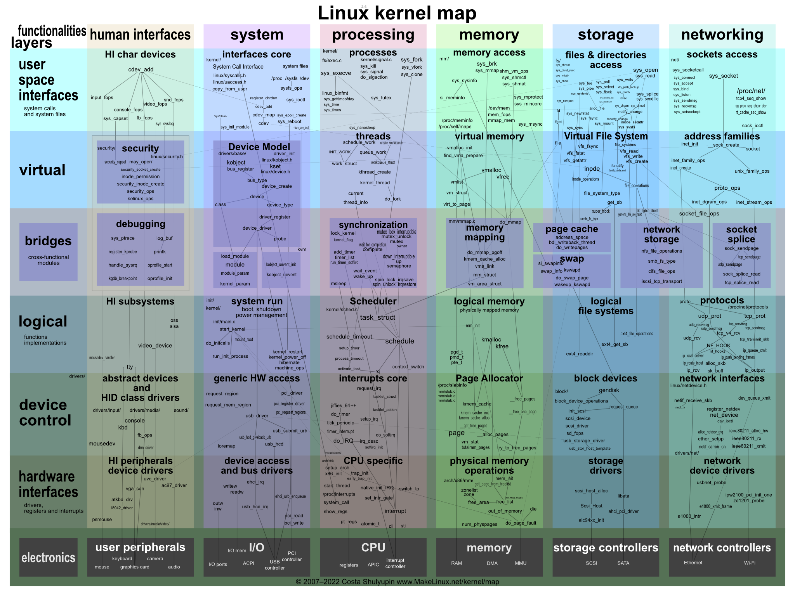
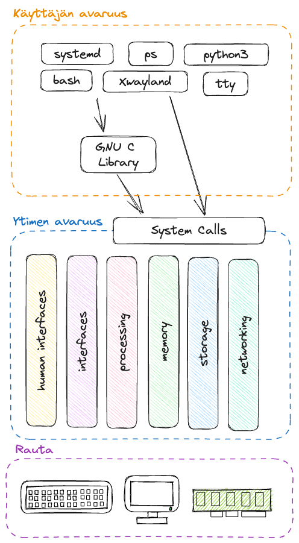

# Kernel

Ydin eli kernel on C-kielelllä ja pienissä määrin assemblyllä kirjoitettu, käyttämällesi prosessorille sopivaksi binääriksi käännetty ohjelma, joka ladataan muistiin tietokoneen käynnistyessä. Ensimmäisen kernelin on kirjoittanut Linus Torvals, joka yhä hallinnoi Linuxin ytimen kehitystä. Ytimen ensisijaiset tehtävät ovat kommunikoida raudan kanssa ja tarjota muille prosesseille pääsy näihin rajapintojen kautta sekä luoda ympäristö, jossa näitä muita ohjelmia voidaan ajaa. Sulautettu järjestelmä, jossa pyörii vain yksi ohjelma, ei tarvitse käyttöjärjestelmää laisinkaan. Termit "käyttöjärjestelmä" ja "kernel" voidaan käytännössä nähdä synonyymeina.

Kernel hallitsee muun muassa seuraavia asioita:

* Prosessit
* Muisti
* Laiteajurit
* System calls

Ydin on avointa lähdekoodia ja sen voi ladata [kernel.org-sivustolta](https://kernel.org/). Huomaathan, että eli distribuutiot voivat halutessaan muokata ydintä. Esimerkiksi Ubuntun ytimen koodin voi ladata komennolla `sudo apt install linux-source`. Se tallentuu lokaatioon `/usr/src/` tarballina.

Kun ajossa oleva ohjelma (eli prosessi) haluaa kommunikoida raudan kanssa, se luo ytimen määrittelemän rajapinnan mukaisen pyynnön, ja ydin joko sallii tai estää pääsyn. Tämä rajapinta on `syscall` eli `system call` ja rajapinta käyttää assembly-kieltä (ks. `man 2 intro`). Tyypillisesti ohjelmat kuitenkin käyttävät C Standard Libraryä (ks. `man 3 intro`), joka on abstraktio ytimen rajapinnasta. Jos ydin sallii pääsyn, ydin kommunikoi raudan kanssa ja palauttaa vastauksen prosessille rajapinnan mukaisesti. Ydin siis piilottaa kaiken low-level toteutuksen taakseen eli *abstrahoi* sen.

Alla näkyy kartta ytimen sisuksista jaettuna ulkoisten rajapintojen mukaisiin kaistoihin.



**Kuvio 1**: *Kartta Linuxin kernelistä. Alkuperäinen, interaktiivinen kuva löytyy: [Interactive map of Linux kernel (makelinux.github.io)](https://makelinux.github.io/kernel/map/). Kuva tallennettu kurssimateriaaliin saatavuuden varmistamiseksi.*

Mikäli haluat nähdä, mitä Standard C-libraryn kutsuja jokin komento kutsuu, voit tehdä sen `ltrace`-ohjelmalla. Jos sen sijaan haluat nähdä, mitä alemman rajapinnan eli syscallin kutsuja komento kutsuu, voit tehdä sen `strace`-ohjelmalla.

```bash title="Bash"
# Kokeile
$ ltrace ls

# Kokeile myös
$ strace ls

# ...ja kenties
$ strace python3 -c 'print("Hello")'
```

Vaihtoehtoisesti voit listata object dependencyt komennolla `ldd`.

```bash title="Bash"
# Kokeile
$ ldd /usr/bin/ls
```

### Kuka sitä kirjoittaa?

Linuxin kehityksestä vastaa Linus Torvals, mutta hän ei suinkaan kirjoita koko ydintä yksin. Ydin on avointa lähdekoodia, ja kuka tahansa voi osallistua kehitykseen. Käytännössä merkittävä osa koodista on eri yritysten ja organisaatioiden kehittämää. Sivusto LWN.net julkaisee kernel-versioista ajoittain tilastoja, joissa on pyritty yhdistämään henkilöt heidän työnantajiinsa. Ne löytää koostetusti sivulta [kernelnewbies.org/DevelopmentStatistics](https://kernelnewbies.org/DevelopmentStatistics). Kirjoitushetkellä tuoreimman Ubuntu 25.04:n kernel-versio on 6.14, ja sen tilastot löytyvät [Development statistics for 6.14](https://lwn.net/Articles/1013892/). Alla top 15 rivimuutosten mukaan laskettuna:

| #   | Työnantaja   | Prosentti |
| --- | ------------ | --------- |
| 1   | Intel        | 8.9%      |
| 2   | Google       | 8.6%      |
| 3   | (Unknown)    | 8.5%      |
| 4   | Qualcomm     | 8.4%      |
| 5   | AMD          | 7.3%      |
| 6   | Red Hat      | 5.9%      |
| 7   | (None)       | 5.0%      |
| 8   | Cirrus Logic | 3.6%      |
| 9   | Linaro       | 3.6%      |
| 10  | Oracle       | 3.0%      |
| 11  | Meta         | 2.7%      |
| 12  | Cisco        | 2.0%      |
| 13  | Microsoft    | 1.9%      |
| 14  | NVIDIA       | 1.8%      |
| 15  | Bootlin      | 1.5%      |

Huomaa, että osuudet vaihtelevat jonkin verran eri kernel-versioiden välillä. Tutustu ihmeessä tuoreimman version tilastoihin – se on tuskin 6.14 kun luet tätä.


### Ytimen ja käyttäjän avaruus

Ydin itsessään pyörii omana prosessina, joka luo käyttäjän avaruuden eli **"User spacen"**. Käyttäjän avaruudessa suoritetaan ohjelmat, jotka näkyvät tavalla tai toiselle käyttäjälle. Osa näkyy ilmiselvästi, kuten graafinen työpöytä, osa näkyy esimerkiksi komennon `ps aux` avulla. Huomaa, että vaikka avaruuden nimessä on termi käyttäjä, se ei tarkoita, että ohjelmat ovat nimenomaan ihmiskäyttäjän käynnistämiä ja käyttämiä. Myös vailla interaktiivista shelliä ohjelmia ajava Linux-palvelin suorittaa ohjelmat käyttäjäavaruudessa.

Ohjelmat, jotka suoritetaan ytimen avaruudessa, suoritetaan todella laajoilla käyttöoikeuksilla, ja ohjelmilla on lähes rajaton pääsy tietokoneen resursseihin. Käyttäjän avaruudessa suoritettavat ohjelmat ajetaan sen sijaan ytimen niille antamilla ehdoilla. Ohjelman pääsyä muistiin, massamuistiin, prosessoriaikaa, ja muita resursseja voidaan rajata. Käyttäjän näkökulmasta rinnakkain ajettavat ohjelmat ajetaan "yhtä aikaa", mutta käytännössä ohjelmat vuorottelevat CPU:n ytimen tai useiden ytimien laskenta-ajasta. Myös itse ydin tarvitsee CPU-aikaa ja muistia, luonnollisesti.



**Kuvio 2**: *Käyttäjän avaruuden, ytimen avaruuden ja raudan kerrokset.*


### Laiteajurit

Laitteisiin on suora pääsy vain ytimen avaruudessa ajettavilla ohjelmilla. Laiteajurit itsessään ajetaan täten ytimen avaruudessa. Ajuri on joukko ytimen funktioita tai käskyjä, jotka tarjoavat ulospäin rajapinnan, joka noudattaa Virtual File System:n mukaisia käskyjä (open, read, lseek jne.). Laitet itsessään voi olla joko fyyinen laite tai virtuaalinen laite kuten pseudoterminaali. Osa laiteajureista on käännetty staattisesti kerneliin (eng. `statically compiled`), osa lisätään myöhemmin moduuleina (ks. `insmod`, `modprobe`), ja moduulit voidaan myös poistaa muistista.

Moduulit löytyvät polusta `/lib/modules/<kernel-versio-tähän>/kernel/drivers/`. Kerneliin ladatujen moduuleiden statuksen voi listata `lsmod`-komennolla.

```bash title="Bash"
# Etsi jokin moduuli
$ lsmod

# Tsekkaa tiedot moduulista
$ modinfo <moduulin-nimi>
```

Moduulien parametrejä (ks. modinfo output) voi muuttaa `modprobe`-komennolla runtime-ajossa. Pysyvästi parametrejä voi muuttaa `/etc/modprobe.d/`-kansiossa.

```bash title="Bash"
# Käy katsomassa löytyykö
$ sudo ls /etc/modprobe.d/*.conf

# Entäpä täältä
$ sudo ls /etc/module/*/parameters/
```

Laiteajureiden mukana saatetaan asentaa myös käyttäjän avaruuteen ohjelmia. NVidian ajureiden mukana tulee esimerkiksi `nvidia-settings`-binääri, joka asennetaan tuttuun `/usr/bin`-lokaatioon.

Tyypillisesti ajureihin ei kuitenkaan tarvitse käyttäjän puuttua, ja tarvittavat ajurit voi asentaa paketinhallintaohjelmistoa käyttäen, joskin niitä varten voi joutua lisäämään uuden repositoryn.

## Proc

`/proc` on virtuaalinen tiedostojärjestelmä, joka tarjoaa käyttäjälle ja ohjelmille tiedon ytimen tilasta. Tiedostojärjestelmä on virtuaalinen, koska se ei ole tallennettu massamuistiin. Tiedostojen koko on siis 0 KB. Kernel vastaa tiedostojen sisältämän informaation ajantasaisuudesta.

```bash title="Bash"
# Listaa tiedostot. Nuemerot ovat prosessien PIDejä. Näihin tutustut myöhemmissä luvuissa.
$ ls /proc

# Kurkkaa jonkin tiedoston sisältöä. Alla pari esimerkkiä.
$ cat /proc/version
$ cat /proc/cmdline
$ cat /proc/cpuinfo
$ cat /proc/meminfo
```

Hakemisto `/proc/sys/` sisältää tiedostoja, joilla voi muuttaa ytimen asetuksia. Tiedostot ovat tavallisia tekstitiedostoja, joiden sisältöä voi muuttaa. Muutokset eivät kuitenkaan ole pysyviä, vaan ne katoavat, kun tietokone käynnistetään uudelleen.

```bash title="Bash"
# Katso IP forwarding asetus ("reititys")
$ cat /proc/sys/net/ipv4/ip_forward

# Katso se myös sysctl ohjelmalla
$ sysctl net.ipv4.ip_forward
```

## Tehtävät

!!! question "Tehtävä: Kernelin tehtävät"
    
    Selvitä ja kerro omin sanoinesi (lähteisiin nojaten), mitkä ovat Linux kernelin tärkeimmät tehtävät.

    Vinkki: kokeile googlettaa: `linux kernel site:medium.com`