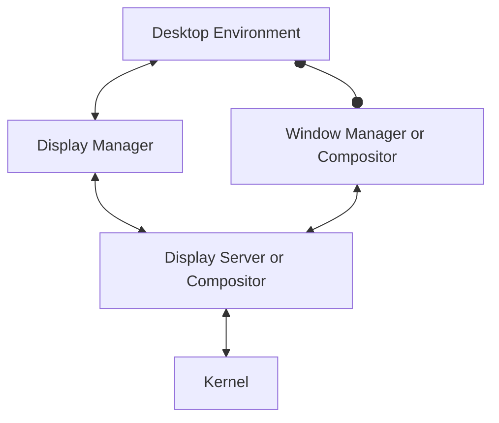

# OS

## Unixista BSD:n kautta GNU/Linuxiin

Unix on eräänlainen Linuxin esi-isä, joka oli olemassa jo keskustietokoneiden (*engl. mainframe*) aikakaudella, kauan ennen kotikoneen (*engl. PC, personal computer*) yleistymistä.

**Kuvio 1**: *Unix-like järjestelmien aikajana. Kuva lainattu [Wikipediasta](https://en.wikipedia.org/wiki/Unix-like).*

AT&T Bell Labs'n UNIX-käyttöliittymän lähdekoodi oli saatavilla, mikä mahdollisti tutkijoiden lisätä siihen toiminnallisuuksia, ja näin Berkeleyn yliopiston tutkijat tekivätkin. Tämä lisämausteilla varustettu käyttöjärjestelmä kasvoi omaksi yliopistojan käyttämäksi Berkeley Software Distributioniksi (BSD). Unix:n koodi on kuitenkin AT&T:n omaisuutta, joten yliopistojen oli pakko maksaa lisenssinmukaisia maksuja AT&T:lle. Ongelma ratkaistiin korvaamalla UNIX-kernel BSD-kernelillä, joka oli AT&T:n kernelin kaltainen, mutta ilman AT&T:n omistusoikeutta. BSD:n kaupalliseksi versioksi tarkoitettu BSDI:tä alettiin myydä 99 % alennuksella (verrattuna System V Unixiin.) Tästä seurasi oikeusjuttu, jossa AT&T syytti BSDI:tä UNIXin lähdekoodin varastamisesta. Oikeusjutun aikana BSD:n kohtalo oli epävarmalla pohjalla, mikä tarjosi hyvän kasvualustan uusille käyttöjärjestelmille, joilla ei ollut suoraa UNIX-taakkaa.

**Kuvio 2**: *Ote [UNIX Programmer Manualista (man13.pdf)](https://www.bell-labs.com/usr/dmr/www/1stEdman.html) sekä Ubuntu 22.04 `man rm`*

Linus Torvalds kirjoitti kernelin, jonka tarkoitus oli olla UNIX:n kaltainen, mutta ilmainen käyttöjärjestelmä. Sen esikuvana toimi Andrew Tanenbaumin MINIX-käyttöjärjestelmä, jonka Tanenbaum kirjoitti akateemisiin tarkoituksiin. Torvalds opiskeli tuolloin Helsingin yliopistossa, ja hän kirjoitti kernelin opiskeluprojektina. Torvalds kirjoitti kernelin aluksi Intel 386-prosessorille, joka oli tuolloin yleinen PC-koneissa ("AT-kloonikoneissa"). Kernel on pääosin C-kieltä ja Assemblyä ja se käännettiin GNU GCC:llä.

>   I'm doing a (free) operating system (just a hobby, won't be big and
>  professional like gnu) for 386(486) AT clones.  This has been brewing
>  since april, and is starting to get ready.  I'd like any feedback on
>  things people like/dislike in minix, as my OS resembles it somewhat
>  (same physical layout of the file-system (due to practical reasons)
>  among other things).
> 
>
>  I've currently ported bash(1.08) and gcc(1.40), and things seem to work.
>  This implies that I'll get something practical within a few months, and
>  I'd like to know what features most people would want.  Any suggestions
>  are welcome, but I won't promise I'll implement them :-)
>
> - Linus Torvalds, 1991, Usenet group comp.os.minix

GNU sen sijaan on Richard Stallmanin perustama projekti, joka pyrki luomaan UNIX-tyylisen käyttöjärjestelmän, joka olisi täysin vapaa. GNU:n Hurd-kernel ei ottanut tuulta alleen, mutta GNU-työkalut olivat jo valmiita, joten Torvalds päätti käyttää niitä. Näin Linux syntyi GNU/Linuxiksi.

> The kernel is an essential part of an operating system, but useless by itself; it can only function in the context of a complete operating system. Linux is normally used in combination with the GNU operating system: the whole system is basically GNU with Linux added, or GNU/Linux. All the so-called “Linux” distributions are really distributions of GNU/Linux.
> - Richard Stallman, [Linux and the GNU System](https://www.gnu.org/gnu/linux-and-gnu.html)

## Linuxin komponentit

Linux koostuu käyttöjärjestelmänä neljästä kerroksesta:

1. Linux kernel
2. GNU utilities
3. Shell (Graafinen tai ei)
4. Ohjelmat (eng. application software)

## Graafisen käyttöliittymän komponentit

Graafinen käyttöympäristö, joka ei siis ole pakollinen osa Linux-distribuutiota, koostuu useista eri osista:

**Kuvio 3**: *Graafiseen käyttöliittymään tyypillisesti liittyvät komponentit. Työpöytäympärstön ja ikkunointiohjelman välillä on erilainen nuoli, koska ne voivat olla toisistaan riippumattomia tai hyvinkin toisiinsa integroituja.*

* [Desktop Environment](https://wiki.archlinux.org/title/Desktop_environment) (suom. työpöytäympäristö)
    * GNOME, KDE, Xfce, Cinammon ja monet muut.
    * Käyttöliittymä, joka sisältää ikonit, paneelit, widgetit, taustakuvat ynnä muut.
    * Se UI/UX-kokonaisuus, jota käytät tyypillisimmin.
* [Window Manager](https://wiki.archlinux.org/title/Window_manager) *(suom. ikkunointiohjelma, näytönjärjestin)*
    * Hallinnoi ikkunoiden sijaintia ruudulla.
    * Mutter (for GNOME Shell), i3, [Hyprland](https://hyprland.org/), Sway, jne.
    * Osa työpöytäympäristöä tai itsenäinen ohjelma.
    * Waylandin kohdalla tämä on osa Compositoria.
* [Display Manager](https://wiki.archlinux.org/title/Display_manager) (suom. näytönhallintaohjelma)
    * GNOME Display Manager (GDM), SDDM, jne.
    * Graafinen kirjautumisnäyttö. Näet tämän päivittäin.
    * Hallitsee sessioiden käynnistämistä ja lopettamista.
* Display Server (suom. näytönhallintajärjestelmä)
    * Järjestelmät: X, Wayland tai Mir.
    * Protokollat: X11, Wayland, Mir.
    * Waylandin kohdalla tämä on osa Compositoria.
* Kernel *(suom. ydin)*
    * Ydin esitellään ensi luvussa.
    * Hiiri ja näppäimistö keskustelevat kernelin kautta Display Serverin kanssa.

Yllä oleva listaus pyrkii olemaan jossain määrin pätevä, vaikka X ja Wayland toimivat eri tavoin. Waylandissä sekä Display Server että Window Manager ovat Compositor. X:ssä Compositor on irrallinen ohjelma, joka puuttuu yllä olevasta graafista ja listauksesta. Tärkeää on kuitenkin muistaa, että Linuxin työpöytäympäristö ei ole yksittäinen ohjelma vaan useista komponenteista koostuva kokonaisuus, jotka ovat jossain määrin vaihdettavissa, jossain määrin toisiinsa integroituja. Jos X:n ja Waylandin ero kiinnostaa, lue Waylandin sivuilta [Wayland Architecture](https://wayland.freedesktop.org/architecture.html). Kyseisessä artikkelissa kuvataan yksittäisen syöttölaitteen (esim. näppäimistön) eventin (esim. painallus) kulkua Kernelistä näytölle X:n ja Waylandin kohdalla.

!!! tip

    Linux ei ole ehkä yleisin työpöytäkäyttöjärjestelmä, mutta se on huomattavan yleinen palvelimissa, sulautetuissa järjestelmissä ja mobiililaitteissa, pilvialustojen taustalla sekä supertietokoneissa.  Tällä kurssilla Linuxia käytetään graafisena käyttöjärjestelmänä, jotta siihen voi tutustua täysin läpikotaisesti - sinun ei tarvitse ajaa esimerkiksi Visual Studio Codea jossain muualla ja tyytyä käyttämään Linuxia kontissa/virtuaalikoneessa. Kenties voit korvata opiskelukäytössä Windowsin kokonaan Linuxilla?

## Linux ja distribuutiot tänään

Linux on nykyään yksi maailman suosituimmista käyttöjärjestelmistä. Se on tyypillinen käyttöjärjestelmä palvelimissa, mobiililaitteissa ja monissa sulautetuissa järjestelmissä. Tyypillisesti asennat Linuxin (tai GNU/Linuxin) käyttäen jotakin distribuution asennusohjelmaa, joka kopioidaan asennusmediaan (esim. USB-tikku tai CD-ROM). Suurimmat pelurit Linuxin distribuutioiden markkinoilla ovat:

* Debian
    * Debian on itsenäinen Linux-jakelu ja Debian-perheeseen kuuluu Canonicalin Ubuntu ja sen perilliset (Linux Mint, jne.)
* Red Hat
    * Red Hat -perheeseen kuuluu itsenäinen jakelu Fedora ja sen perilliset sekä perillisten perilliset (RHEL, CentOS Stream, Rocky jne.)

Muitakin itsenäisiä jakeluita löytyy, kuten Slackware, Gentoo, Arch Linux, openSUSE. Tutustu näihin joko heidän omilla sivuillaan tai [DistroWatch](https://distrowatch.com/)-sivustolla. Työelämässä käytät suurella todennäköisyydellä joko Red Hat -perheen tai Debian-perheen jakelua. Näihin voit tutustua esimerkiksi asentamalla CentOS Stream:n ja Ubuntun virtuaalikoneisiin - kuten tällä kurssilla tehdään.

> More than 60 percent of customer cores in Azure run Linux workloads. Choose from popular Linux distributions including Red Hat, SUSE, Ubuntu, CentOS, Debian, and CoreOS. - [Microsoft Azure](https://azure.microsoft.com/en-us/products/virtual-machines/linux)

Konttien ja Dockerin myötä Linux on myös yleistynyt kehittäjien Windows sekä macOS työasemissa. Tällöin kehittäjillä on Windows/mac-työasema, jossa pyörii Linux-virtuaalikone, jossa pyörii Docker-kontteja. Docker siis käytännössä vaatii Linuxin - joko ihan oikean asennuksen tai esimerkiksi WSL:n (Windows Subsystem for Linux). Huomaathan, että Docker ei kuitenkaan ole ainut peluri konttien maailmassa, vaan esimerkiksi [Podman](https://podman.io/) on Dockerin vaihtoehto. Ethän yritä asentaa Dockeria CentOS Streamiin tai muihin Red Hat -perheen distribuutioihin. Sillä puolella aitaa on käytössä Podman.

**Kuvio 3**: *Linuxin käyttö supertietokoneissa. (By Benedikt.Seidl - Eigenes Werk (own work) / source top500.org, Public Domain, https://commons.wikimedia.org/w/index.php?curid=5932978).*

## Tehtävät

!!! question "Tehtävä: Käyttöjärjestelmän tarve"

    Selvitä, mihin käyttöjärjestelmää ylipäätänsä tarvitaan. Onko se välttämätön osa tietokonetta? Olisiko tietokone nopeampi vai hitaampi ilman käyttöjärjestelmää? Mitä käyttöjärjestelmä tuo tietokoneelle tai sen käyttäjälle, jota ei ilman sitä voisi saavuttaa? Oliko esimerkiksi 8-bittisessä NES:ssä (Nintendo Entertainment System) käyttöjärjestelmää?

!!! question "Tehtävä: Graafinen käyttöliittymä"

    Tutustu asentamasi Linux-distribuution graafiseen käyttöliittymään. Mitä näytönhallintajärjestelmää se käyttää? Mitä työpöytäympäristöä (tai ikkunointijärjestelmän)? Vastauksia löydät distribuution omilta sivuilta tai esimerkiksi [DistroWatch](https://distrowatch.com/)-sivustolta, mutta kokeile myös, löytyyko vastaus Terminaalin avulla. Terminaalin käyttö neuvotaan vasta myöhemmin, mutta voit kokeilla jo nyt ajaa löytämiäsi komentoja. 

!!! question "Tehtävä: Wayland vs X11"

    Wayland on korvaamassa/korvannut X11:n. Tutustu Waylandiin ja sen eroihin X11:een esimerkiksi lukemalla artikkelin [Wayland Architecture](https://wayland.freedesktop.org/architecture.html). Miksi Wayland on kehitetty? Mitä eroja Waylandilla on X11:een verrattuna?

!!! question "Tehtävä: Suositellut jakelut"

    Tällä kurssilla suositellaan Ubuntu-jakelua (*eng. distribution*). Etsi internetistä suositeltujen distribuutioiden listoja - erityisesti aloittelijoille, mutta miksei myös eri käyttöihin. Mitä distribuutioita löydät listoilta?

!!! question "Tehtävä: LTS-lyhenne"

    Ubuntun version 24.04 yhteydessä esiintyy LTS-lyhenne. Mitä LTS tarkoittaa?
