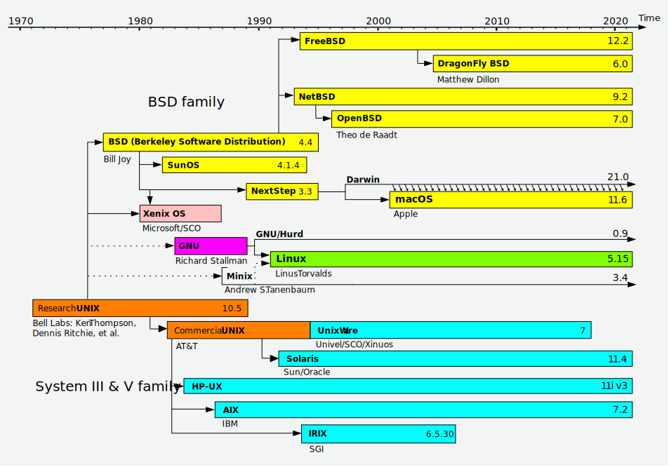
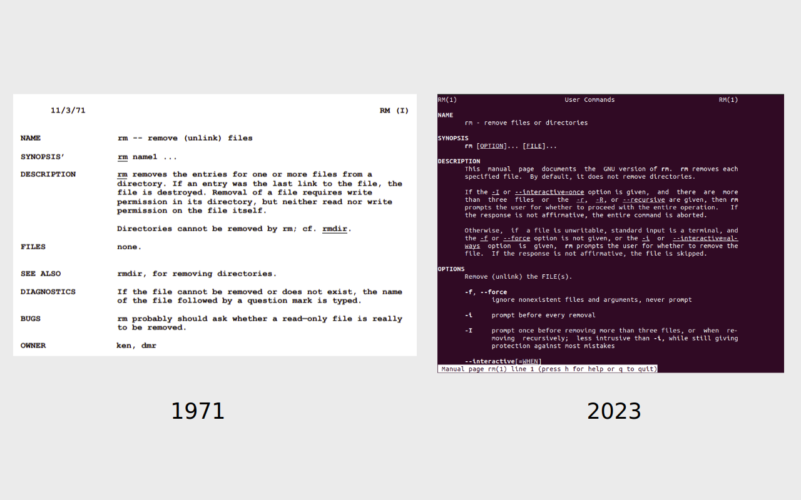

## Tarvitaanko käyttöjärjestelmää?

## Unixista alkaen

Unix on eräänlainen Linuxin esi-isä, joka oli olemassa jo keskustietokoneiden (`mainframe`) aikakaudella, kauan ennen kotikoneen eli PC:n eli personal computerin yleistymistä.

TODO: Kirjoita tähän tärkeimmät stepit historiasta.

**Kuvio 1**: *Unix-like järjestelmien aikajana. Kuva lainattu [Wikipediasta](https://en.wikipedia.org/wiki/Unix-like).*

**Kuvio 2**: *Ote [UNIX Programmer Manualista (man13.pdf)](https://www.bell-labs.com/usr/dmr/www/1stEdman.html) sekä Ubuntu 22.04 `man rm`*

