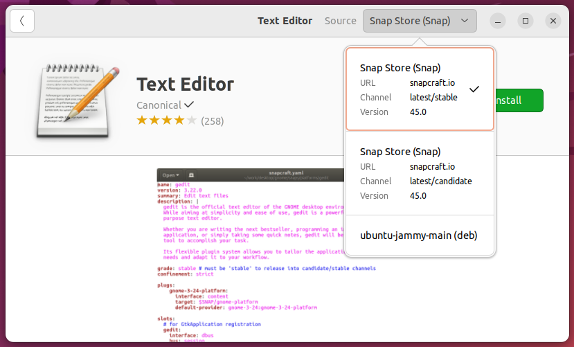

# Cross-distro



**Kuvio 1**: *Ubuntu Software store. Useimmat ohjelmat, kuten Text Editor, voi asentaa Snap Storesta. Joskus vaihtoehtona näkyy ATP, kuten kuvakaappauksessa (ubuntu-jammy-main, joka viittaa apt repositorioon main, versioon jammy eli tässä tapauksessa 22.04)*

Aiemmin mainittujen, tiettyyn distribuutioon (tai sen jälkiläisiin) sidottujen paketinhallintajärjestelmien lisäksi on olemassa myös järjestelmiä, jotka toimivat useissa eri distribuutioissa. Näistä esitellään lyhyesti alla kolme: **Flatpak**, **AppImage** ja **Snap**, joista jälkimmäiseen viitataan myös yllä näkyvässä Kuvio 1:ssä. Helpon asennuksen lisäksi useimmat näistä pyrkivät tarjoamaan turvallisuuteen liittyviä ominaisuuksia joko siten, että ohjelma voidaan asentaa ja ajaa lokaalisti käyttäjän omilla tunnuksilla ja oikeuksilla, tai siten, että ohjelma ajetaan konttia muistuttavassa sandbox-ympäristössä.

#### AppImage

AppImage on äärimmäisen yksinkertainen paketti käyttää. Toisin kuin muut tässä dokumentissa mainitut paketinhallintajärjestelmät, AppImage ei asenna mitään minnekään, eikä paketinhallinta itsessään vaadi minkään sortin asentamista.

Vaiheet ovat näinkin simppelit:

1. Etsi haluamasi sovellus AppImageHubista, kuten vaikkapa e-kirjojen lukemiseen soveltuva Calibre.
2. Lataa tuore versio ohjelmisto .

```bash
# Navigoi kotikansiosi lokaalien sovellusten hakemistoon
$ cd ~/.local/bin/

# Siirrä tiedosto latauskansiosta
$ mv ~/Downloads/Calibre-x86-64-20230918202913.AppImage calibre.AppImage

# Tee tiedostosta ajettava ja aja se
$ chmod u+x calibre.AppImage
$ ./calibre.AppImage
```

Sovellusvalikoima on kuitenkin AppImagessa ainakin kirjoitushetkellä huomattavasti suppeampi kuin kilpailijoissa, ja lisäksi ARM-prosessorille soveltuvia sovelluksia on merkittävästi vähemmän kuin `x84_64`:lle.


#### Flatpak

Flatpakin itsensä voi asentaa Ubuntuun [Flatpakin ohjeiden mukaisesti](https://flatpak.org/setup/Ubuntu) komennolla:

```bash
$ sudo apt install flatpak
```


Flatpakin avulla asennettavia ohjelmia voi etsiä [Flathub](https://flathub.org/):sta. Repositorion itsensä ja ohjelmat voi asentaa joko käyttäjän omiin hakemistoihin tai järjestelmänlaajuisesti. Tämä asetetaan `--user`- tai `--system`-flagilla. Näistä jälkimmäinen on default, ja se vaatii sudo-oikeudet.

Esimerkiksi HandBrake CLI:n, jolla voi muun muassa enkoodata videotiedostoja, voi asentaa ilman sudo-oikeuksia näin:

```bash
# Lisää Flatpak repo
$ flatpak --user remote-add \
--if-not-exists flathub \
https://dl.flathub.org/repo/flathub.flatpakrepo

# Lokaalista tiedostosta
$ flatpak --user install HandBrakeCLI-1.4.2-x86_64.flatpak
```

!!! question "Tehtävä"

    Tutki, minne Flatpak asensi tämän user-wide asennuksen.

Tai kenties haluat eroon Snapin hallitsemasta Firefoxista ja siirtyä Flatpakin asentamaan ja hallitsemaan chromiumiin?

```bash
# Poista Snap koko järjestelmästä. Ethän tee tätä koneilla, joilla muut käyttäjät saattavat haluta käyttää Firefoxia. Se oikeasti poistuu.
$ sudo snap remove firefox

# Asenna Chromium
$ sudo flatpak install flathub org.chromium.Chromium
```

!!! warning

    Saatat joutua lisäämään `remote-add`:llä repositorion erikseen system-wide. Päättele, millä komennolla tämä hoituu käyttäen yllä näkyvää user-wide esimerkkiä.

Yllä olevan komennon jälkeen sinun pitää logata ulos ja sisään Gnomesta (tai muusta työpöytäympäristöstä.) Tämän jälkeen voit painaa ++windows++ (tai ++command++) näppäintä, etsiä Chromiumin, ja joko käynnistää sen tai lisätä sen hiiren oikealla korvalla Favoritesiin, missä Firefox todennäköisesti aiemmin oli.

Flatpak eristää sovellukset muusta käyttöjärjestelmästä omiin sandboxeihin. Lue lisää siitä, kuinka Flatpak toimii konepellin alla: [Under the Hood — Flatpak documentation](https://docs.flatpak.org/en/latest/under-the-hood.html)


#### Snap

Snap-ohjelmaan liittyvät seuraavat termit:

| Termi      | Selitys                                                                                                                      |
| ---------- | ---------------------------------------------------------------------------------------------------------------------------- |
| Snap       | Applikaatio-bundle, joka sisältää kaikki tarvittavat riippuvuudet.                                                           |
| Snapd      | Taustalla ajettava daemon eli service, joka huolehtii asennetuista snapeista.                                                |
| Snap Store | Alusta tai katalogi, joka löytyy [verkosta](https://snapcraft.io/store), ja johon snapit lähetetään käyttäjien ladattaviksi. |
| Snapcraft  | Ajettavan komennon ja frameworkin nimi.                                                                                      |

Snap eristää ohjelmat muusta käyttöjärjestelmästä omiin sandboxeihin:

> To support this, each package is sandboxed so that it runs in a constrained environment, isolated from the rest of the system – this is achieved via a combination of AppArmor, seccomp, mount namespaces, cgroups and traditional UNIX permissions. -- [Ubuntu.com](https://ubuntu.com/blog/a-guide-to-snap-permissions-and-interfaces)

Canonical on sekä Snapcraftin että Ubuntun takana. Siispä ei liene liene yllätys, että snap on Ubuntussa valmiiksi asennettuna. Mikäli käytät jotakin toista distribuutiota, jossa snap ei ole vakiona asennettuna, etsi ohje mieluiten suoraan työkalun omasta dokumentaatiosta, kuten: [Installing the daemon](https://snapcraft.io/docs/installing-snapd). Ohjelmien listaaminen ja asentaminen on helppoa, katso komennot alta:

```bash
# Listaa asennetut
$ snap list

# Asenna ohjelma
$ sudo snap install <program>
```

!!! tip 

    Huomaa, että paketit asennetaan `/snap`-hakemistoon eikä tyypilliseen `/usr/bin`-hakemistoon. Esimerkiksi firefoxin löytää `/snap/bin/firefox`-polusta. Tiedosto `/usr/bin/firefox` löytyy $PATH:sta, mutta jos ajat komennon `file /usr/bin/firefox`, näet, että se on ihan vain ASCII shell script. Tiedosto itsessään ajaa `/snap/bin/firefox`-tiedoston. Tämä sen sijaan on symbolinen linkki `/usr/bin/snap`-tiedostoon, joka on itse asiassa binääri. Tämä binääri nuuhkii argumentit (`$0`) ja suorittaa oikean ohjelman.

Ohjelmia ei ole tarpeellista päivittää käsin. Ne voi päivittää `sudo snap refresh`-komennolla, mutta snap tekee tämän automaattisesti vakiona 6 tunnin välein.

Huomaa, että tämä lyhyt ohje on todellakin vain lyhyt ohje. Snapin käyttöön liittyy paljon muutakin, kuten esimerkiksi oikeuksien hallinta, joka on toteutettu käyttämällä interfaces, tai snapshots, joka sallii ohjelmien palauttamisen aiempaan tilaan. Lisäksi snap:llä asennetut palvelut ovat hallittavissa services-komennolla. Näihin toiminnallisuuksiin voit tutustua [Snap how-to guides](https://snapcraft.io/docs/snap-howto)-sivulla.