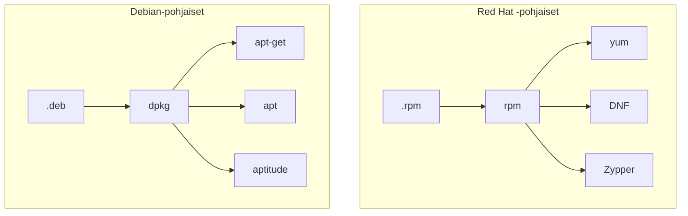

Kuten aiemmassa luvussa todettiin, applikaatiot jaellaan perinteisesti ohjelmapaketteina (eng. package). Tyypillisesti paketit ovat joitakin seuraavista:

| Tiedostopääte          | Kuvaus                                                       |
| ---------------------- | ------------------------------------------------------------ |
| .deb                   | Debian-pohjaisten distribuutioiden käyttämä formaatti.       |
| .rpm                   | Red Hat  -pohjaisten distribuutioiden käyttämä formaatti.    |
| .pkg.tar.zst           | Arch Linuxin pacmanin käyttämä formaatti.                    |
| .apk                   | Alpine:n apk:n käyttämä formaatti.                           |
| .ebuild                | Gentoo:n Portagen käyttämä formaatti.                        |
| .tar, .tar.gz, tar.bz2 | Ei varsinaisesti oma formaatti paketeille, mutta osa ohjelmistoista levitetään pakattuina tar-paketteina (tarball), ja macOS:n ekosysteemistä tuttu HomeBrew käyttää tätä formaattia konepellin alla. |

!!! warning
    Jos jokin ohjelma käskee asentamaan itsensä tarballista (`.tar.gz` tai `.tar`), yleensä sisältäen vaiheita `./configure`, `make` ja `sudo make install`, ohjelma asennetaan Linuxiin siten, että se ja sen riippuvuudet eivät kuulu paketinhallinnan piiriin. Ohjelma ja sen riippuvuudet voi olla huomattavan vaikea poistaa, joskin komento `sudo make uninstall` saattaa toimia. Lähtökohtaisesti kannattaa vältellä `tarball`-tyylistä lähestymistapaa, mikäli ohjelman voi asentaa jollakin muulla tavalla kuten `apt-get` tai `yum`:n avulla. Debian-pohjaissa järjestelmissä on mahdollista luoda lähdekoodista `.deb`-paketti käyttäen [CheckInstall)](https://help.ubuntu.com/community/CheckInstall):ia `sudo make install`:n sijasta. Näin asennetut ohjelmat kuuluvat paketinhallinnan piiriin ja ne voidaan poistaa `apt-get`-komentojen avulla.


## Paketinhallintaohjelmisto

Paketteja (`.deb` ja `.rpm` ynnä muita) ei ole tarkoitettu ajettavaksi sinällään, vaan ne asennetaan paketinhallintaohjelmiston avulla (eng. package manager). Paketinhallintaohjelmisto tietää käyttämänsä paketin skeeman: mistä löytyy konfiguraatiot, kuinka niitä luetaan, mihin ohjelma kuuluu asentaa, kuinka ohjelma kuuluu asentaa, ja niin edelleen.

On hyvin todennäköistä, että olet tällä kursilla asentanut joko Debian tai Red Hat -pohjaisen distribuution, joten keskitytään niiden paketinhallintaan. Näiden paketteja asennetaan, hallitaan ja poistetaan tyypillisesti työkaluille, jotka näkyvät alla olevassa graafissa. Huomaa, että Debian-pohjaisesta distribuutiosta löytyvät yleensä kaikki graafissa näkyvät, ja ne ovat järjestyksessä matalamman tason ohjelmasta ylemmän tason ohjelmaan: `dpkg`, `apt-get`, `apt`, `aptitude`. Red Hat -pohjaisissa distribuutioissa on jokin tai jotkin graafissa näkyvistä ohjelmista. Distrojen vanhemmat versiot kuten Amazon Linux 2, CentOS, Fedora ja RHEL käyttävät `yum`:ia. Amazon Linux 3 ja muiden distrojen tuoreemmat versiot ovat siirtyneet käyttämään `DNF`:ää. Sen sijaan `Zypper` on SUSE:ssa käytössä.



!!! question "Tehtävä"
    Selvitä, mitä paketinhallintaa sinun distrosi käyttää. Tutustu siihen `man`-komennon avulla.


## Repositoriot

Yleisesti ottaen paketteja (`.deb` tai `.rpm`) ei ladata käsin koneelle, ellei ole tarvetta suorittaa offline-asennussta. Paketinhallintaohjelmistot hakevat paketit suoraan repositoriosta. Käytetyt repositoriot riippuvat distribuutiosta. Red Hat -pohjaisissa distribuutioissa voit lähteä liikenteelle komennosta `dnf repolist`. Esimerkiksi Ubuntussa voit tutustua aiheeseen manuaalin sivuilta, jotka löytyvät komennolla: `man -k sources.list`, ja  sitä myöden `cat /etc/apt/sources.list` sekä `cat /etc/apt/sources.list.d/*`.


Mikäli jokin ohjelma neuvoo sinua lisäämään uuden repositorion distribuutiosi listaan, olethan varovainen. Repositorio ei ole tällöin distribuution luojien omassa hallussa vaan kolmannen osapuolen repo.

Ubuntun ekosysteemissä on olemassa Launchpad, ja esimerkiksi Pythonista voi ladata tuoreempia versioita käyttämällä PPA (Personal Package Archives)-repositoriota nimeltään [Deadsnakes](https://launchpad.net/~deadsnakes/+archive/ubuntu/ppa)


## Komentoja

Repositorion metadatan voi päivittää omalle koneelle yleensä komennolla `update`. Samalla vaivalla voi yleensä tarkistaa, mitkä asennetuista ohjelmista ovat saaneet asennettua tuoreemman version paketinhallintaan. Tyypillisesti löydät haluamasi ohjelmiston asentamiseen ja poistamiseen tarvittavat komennot ohjelmiston dokumentaatiosta, mutta peruskomennot on hyvä tuntea.

#### Päivitä ohjelmat

```bash
# DNF
$ sudo dnf check-update
$ sudo dnf upgrade

# APT
$ sudo apt update
$ sudo apt list --upgradable
$ sudo apt upgrade
```

#### Listaa asennetut ohjelmat

```bash
# DNF
$ dnf list installed

# APT
$ apt list installed
```

#### Etsi uusia ohjelmia ja lue info

```bash
# DNF
$ dnf search "hakusana"
$ dnf info <package-name>

# APT
$ apt search "hakusana"
$ apt info <package-name>
```

#### Listaa ohjelman tiedostot

```bash
# DNF
$ rpm -ql <package-name>

# APT (tai dpkg)
$ dpkg -L <package-name>
```

#### Tee reverse-haku eli katso mihin packageen tiedosto kuuluu

```bash
# DNF
$ dnf provides /path/to/file

# APT
$ dpkg -S /path/to/file
```

#### Poista ohjelma

```bash
# DNF
sudo dnf remove <package-name>
sudo dnf autoremove # Riippuvuudet

# APT
sudo apt remove <package-name>
sudo apt autoremove # Riippuvuudet
```


## Cross-distro paketinhallinta


**Kuvio 1**: *Ubuntu Software store. Useimmat ohjelmat, kuten Text Editor, voi asentaa Snap Storesta. Joskus vaihtoehtona näkyy ATP, kuten kuvakaappauksessa (ubuntu-jammy-main, joka viittaa apt repositorioon main, versioon jammy eli 22.04)*

Yllä mainittujen, tiettyyn distribuutioon (tai sen jälkiläisiin) sidottujen paketinhallintajärjestelmien lisäksi on olemassa myös järjestelmiä, jotka toimivat useissa eri distribuutioissa. Näistä esitellään lyhyesti alla kolme: **Flatpak**, **AppImage** ja **Snap**, joista jälkimmäiseen viitataan myös yllä näkyvässä Kuvio 1:ssä. Helpon asennuksen lisäksi useimmat näistä pyrkivät tarjoamaan turvallisuuteen liittyviä ominaisuuksia joko siten, että ohjelma voidaan asentaa ja ajaa lokaalisti käyttäjän omilla tunnuksilla ja oikeuksilla, tai siten, että ohjelma ajetaan konttia muistuttavassa sandbox-ympäristössä.


#### AppImage

AppImage on äärimmäisen yksinkertainen paketti käyttää. Toisin kuin muut tässä dokumentissa mainitut paketinhallintajärjestelmät, AppImage ei asenna mitään minnekään, eikä paketinhallinta itsessään vaadi minkään sortin asentamista.

Vaiheet ovat näinkin simppelit:

1. Etsi haluamasi sovellus AppImageHubista, kuten vaikkapa e-kirjojen lukemiseen soveltuva Calibre.
2. Lataa tuore versio ohjelmisto .

```bash
# Navigoi kotikansiosi lokaalien sovellusten hakemistoon
cd ~/.local/bin/

# Siirrä tiedosto latauskansiosta
$ mv ~/Downloads/Calibre-x86-64-20230918202913.AppImage calibre.AppImage

# Tee tiedostosta ajettava ja aja se
$ chmod u+x calibre.AppImage
$ ./calibre.AppImage
```

Sovellusvalikoima on kuitenkin AppImagessa ainakin kirjoitushetkellä huomattavasti suppeampi kuin kilpailijoissa, ja lisäksi ARM-prosessorille soveltuvia sovelluksia on merkittävästi vähemmän kuin `x84_64`:lle.


#### Flatpak

Flatpakin itsensä voi asentaa Ubuntuun [Flatpakin ohjeiden mukaisesti](https://flatpak.org/setup/Ubuntu) komennolla:

```bash
$ sudo apt install flatpak

# Lisää Flatpak repo
$ flatpak remote-add \
--if-not-exists flathub \
https://dl.flathub.org/repo/flathub.flatpakrepo
```

Flatpakin avulla asennettavia ohjelmia voi etsiä [Flathub](https://flathub.org/):sta, mikäli lisäsit sen yllä olevalla komennolla.

Esimerkiksi HandBrake CLI:n, jolla voi muun muassa enkoodata videotiedostoja, voi asentaa ilman sudo-oikeuksia näin:

```bash
# Lokaalista tiedostosta
$ flatpak --user install HandBrakeCLI-1.4.2-x86_64.flatpak
```

Tai kenties haluat eroon Snapin hallitsemasta Firefoxista ja siirtyä Flatpakin asentamaan ja hallitsemaan chromiumiin?

```bash
# Poista Snap koko järjestelmästä. Ethän tee tätä koneilla, joilla muut käyttäjät saattavat haluta käyttää Firefoxia. Se oikeasti poistuu.
$ sudo snap remove firefox

# Asenna Chromium
$ flatpak install flathub org.chromium.Chromium
```

Yllä olevan komennon jälkeen sinun pitää logata ulos ja sisään Gnomesta (tai muusta työpöytäympäristöstä.) Tämän jälkeen voit painaa ++windows++ (tai ++command++) näppäintä, etsiä Chromiumin, ja joko käynnistää sen tai lisätä sen hiiren oikealla korvalla Favoritesiin, missä Firefox todennäköisesti aiemmin oli.

Flatpak eristää sovellukset muusta käyttöjärjestelmästä omiin sandboxeihin. Lue lisää siitä, kuinka Flatpak toimii konepellin alla: [Under the Hood — Flatpak documentation](https://docs.flatpak.org/en/latest/under-the-hood.html)


#### Snap

Snap-ohjelmaan liittyvät seuraavat termit:

| Termi      | Selitys                                                      |
| ---------- | ------------------------------------------------------------ |
| Snap       | Applikaatio-bundle, joka sisältää kaikki tarvittavat riippuvuudet. |
| Snapd      | Taustalla ajettava daemon eli service, joka huolehtii asennetuista snapeista. |
| Snap Store | Alusta tai katalogi, joka löytyy [verkosta](https://snapcraft.io/store), ja johon snapit lähetetään käyttäjien ladattaviksi. |
| Snapcraft  | Ajettavan komennon ja frameworkin nimi.                      |

Snap eristää ohjelmat muusta käyttöjärjestelmästä omiin sandboxeihin:

> To support this, each package is sandboxed so that it runs in a constrained environment, isolated from the rest of the system – this is achieved via a combination of AppArmor, seccomp, mount namespaces, cgroups and traditional UNIX permissions. -- [Ubuntu.com](https://ubuntu.com/blog/a-guide-to-snap-permissions-and-interfaces)

