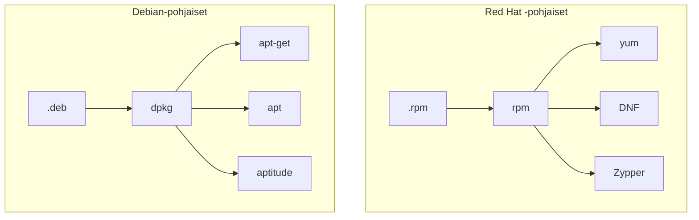

# Ohjelmapaketit

Kuten aiemmassa luvussa todettiin, applikaatiot jaellaan perinteisesti ohjelmapaketteina (eng. package). Tyypillisesti paketit ovat joitakin seuraavista:

| Tiedostopääte          | Kuvaus                                                                                                                                                                                                |
| ---------------------- | ----------------------------------------------------------------------------------------------------------------------------------------------------------------------------------------------------- |
| .deb                   | Debian-pohjaisten distribuutioiden käyttämä formaatti.                                                                                                                                                |
| .rpm                   | Red Hat  -pohjaisten distribuutioiden käyttämä formaatti.                                                                                                                                             |
| .pkg.tar.zst           | Arch Linuxin pacmanin käyttämä formaatti.                                                                                                                                                             |
| .apk                   | Alpine:n apk:n käyttämä formaatti.                                                                                                                                                                    |
| .ebuild                | Gentoo:n Portagen käyttämä formaatti.                                                                                                                                                                 |
| .tar, .tar.gz, tar.bz2 | Ei varsinaisesti oma formaatti paketeille, mutta osa ohjelmistoista levitetään pakattuina tar-paketteina (tarball), ja macOS:n ekosysteemistä tuttu HomeBrew käyttää tätä formaattia konepellin alla. |

!!! warning
    Jos jokin ohjelma käskee asentamaan itsensä tarballista (`.tar.gz` tai `.tar`), yleensä sisältäen vaiheita `./configure`, `make` ja `sudo make install`, ohjelma asennetaan Linuxiin siten, että se ja sen riippuvuudet eivät kuulu paketinhallinnan piiriin. Ohjelma ja sen riippuvuudet voi olla huomattavan vaikea poistaa, joskin komento `sudo make uninstall` saattaa toimia. Lähtökohtaisesti kannattaa vältellä `tarball`-tyylistä lähestymistapaa, mikäli ohjelman voi asentaa jollakin muulla tavalla kuten `apt-get` tai `yum`:n avulla. Debian-pohjaissa järjestelmissä on mahdollista luoda lähdekoodista `.deb`-paketti käyttäen [CheckInstall)](https://help.ubuntu.com/community/CheckInstall):ia `sudo make install`:n sijasta. Näin asennetut ohjelmat kuuluvat paketinhallinnan piiriin ja ne voidaan poistaa `apt-get`-komentojen avulla.


## Paketinhallintaohjelmisto

Paketteja (`.deb` ja `.rpm` ynnä muita) ei ole tarkoitettu ajettavaksi sinällään, vaan ne asennetaan paketinhallintaohjelmiston avulla (eng. package manager). Paketinhallintaohjelmisto tietää käyttämänsä paketin skeeman: mistä löytyy konfiguraatiot, kuinka niitä luetaan, mihin ohjelma kuuluu asentaa, kuinka ohjelma kuuluu asentaa, ja niin edelleen.

On hyvin todennäköistä, että olet tällä kursilla asentanut joko Debian tai Red Hat -pohjaisen distribuution, joten keskitytään niiden paketinhallintaan. Näiden paketteja asennetaan, hallitaan ja poistetaan tyypillisesti työkaluille, jotka näkyvät alla olevassa graafissa. Huomaa, että Debian-pohjaisesta distribuutiosta löytyvät yleensä kaikki graafissa näkyvät, ja ne ovat järjestyksessä matalamman tason ohjelmasta ylemmän tason ohjelmaan: `dpkg`, `apt-get`, `apt`, `aptitude`. Red Hat -pohjaisissa distribuutioissa on jokin tai jotkin graafissa näkyvistä ohjelmista. Distrojen vanhemmat versiot kuten Amazon Linux 2, CentOS, Fedora ja RHEL käyttävät `yum`:ia. Amazon Linux 3 ja muiden distrojen tuoreemmat versiot ovat siirtyneet käyttämään `DNF`:ää. Sen sijaan `Zypper` on SUSE:ssa käytössä.




## Repositoriot

Yleisesti ottaen paketteja (`.deb` tai `.rpm`) ei ladata käsin koneelle, ellei ole tarvetta suorittaa offline-asennussta. Paketinhallintaohjelmistot hakevat paketit suoraan repositoriosta. Käytetyt repositoriot riippuvat distribuutiosta. Red Hat -pohjaisissa distribuutioissa voit lähteä liikenteelle komennosta `dnf repolist`. Esimerkiksi Ubuntussa voit tutustua aiheeseen manuaalin sivuilta, jotka löytyvät komennolla: `man -k sources.list`, ja  sitä myöden `cat /etc/apt/sources.list` sekä `cat /etc/apt/sources.list.d/*`.


Mikäli jokin ohjelma neuvoo sinua lisäämään uuden repositorion distribuutiosi listaan, olethan varovainen. Repositorio ei ole tällöin distribuution luojien omassa hallussa vaan kolmannen osapuolen repo.

Ubuntun ekosysteemissä on olemassa Launchpad, ja esimerkiksi Pythonista voi ladata tuoreempia versioita käyttämällä PPA (Personal Package Archives)-repositoriota nimeltään [Deadsnakes](https://launchpad.net/~deadsnakes/+archive/ubuntu/ppa)


## Komentoja

Repositorion metadatan voi päivittää omalle koneelle yleensä komennolla `update`. Samalla vaivalla voi yleensä tarkistaa, mitkä asennetuista ohjelmista ovat saaneet asennettua tuoreemman version paketinhallintaan. Tyypillisesti löydät haluamasi ohjelmiston asentamiseen ja poistamiseen tarvittavat komennot ohjelmiston dokumentaatiosta, mutta peruskomennot on hyvä tuntea.

#### Päivitä ohjelmat

```bash title="Bash"
# DNF
$ sudo dnf check-update
$ sudo dnf upgrade

# APT
$ sudo apt update
$ sudo apt list --upgradable
$ sudo apt upgrade
```

#### Listaa asennetut ohjelmat

```bash title="Bash"
# DNF
$ dnf list installed

# APT
$ apt list --installed
```

#### Etsi uusia ohjelmia ja lue info

```bash title="Bash"
# DNF
$ dnf search "hakusana"
$ dnf info <package-name>

# APT
$ apt search "hakusana"
$ apt info <package-name>
$ apt-cache search <package-name>
```

#### Listaa ohjelman tiedostot

```bash title="Bash"
# DNF
$ rpm -ql <package-name>

# APT (tai dpkg)
$ dpkg -L <package-name>
```

#### Tee reverse-haku eli katso mihin packageen tiedosto kuuluu

```bash title="Bash"
# DNF
$ dnf provides /path/to/file

# APT
$ dpkg -S /path/to/file
```

#### Poista ohjelma

```bash title="Bash"
# DNF
$ sudo dnf remove <package-name>
$ sudo dnf autoremove # Riippuvuudet

# APT
$ sudo apt remove <package-name>
$ sudo apt autoremove # Riippuvuudet
```

## Tehtävät

!!! question "Tehtävä: Asenna ohjelma"
    
    Asenna jokin ohjelma paketinhallinnan avulla. Valitse ohjelma itse, mutta käytä paketinhallintaa (apt). Voit asentaa esimerkiksi `nsnake`-pelin, joka on terminaalissa toimiva matopeli.

!!! question "Tehtävä: Selvitä ohjelman tiedostot"
    
    Selvitä, missä ohjelman `nsnake` tiedostot sijaitsevat. Käytä `dpkg`- tai `rpm`-komentoa.

!!! question "Tehtävä: Asennuslokaatiot"

    Eri tavoin asennetut ohjelmat sijoittuvat eri paikkoihin. Selvitä, mitä eroa on seuraavilla usein käytössä olevilla lokaatioilla.

    * `/usr/bin`
    * `/usr/local/bin`
    * `/opt`
    * `/home/$USER/.local/bin`

!!! question "Tehtävä: Sources.List"

    Tutustu `sources.list`-tiedostoon ja siihen liittyvään `sources.list.d`-hakemistoon. Mistä hakemistosta ne löytyvät? Mikä on niiden tarkoitus. Kannattaa hyödyntää `man 5 sources.list`-komennon antamaa tietoa.

    Käytännön esimerkin löydät Azure CLI:n asennusohjeista: [Install the Azure CLI on Linux](https://learn.microsoft.com/en-us/cli/azure/install-azure-cli-linux?pivots=apt#option-2-step-by-step-installation-instructions)

    Vinkki: tutustu myös [Ubuntu Desktop Guide: Add software repositories](https://help.ubuntu.com/stable/ubuntu-help/addremove-sources.html.en)

!!! question "Tehtävä: Mikä on PPA?"

    Ubuntun ekosysteemissä Launchpad on *forge*-tyylinen palvelu, jossa on sekä koodivarastoja että pakettivarastoja. PPA:n tunnistaa muodosta `ppa:username/ppa-name`, joka viittaa pidempään `http://ppa.launchpad.net/username/ppa-name/ubuntu` URL:iin

    Esimerkki: 
    
    * OBS Studio
        * Asennusohjeet: [obsproject.com/download](https://obsproject.com/download#linux)
        * Launchpad: [obsproject/obs-studio](https://launchpad.net/~obsproject/+archive/ubuntu/obs-studio)
        * PPA data: [Index of /obsproject/obs-studio/ubuntu](http://ppa.launchpad.net/obsproject/obs-studio/ubuntu/)
  
    Selvitä, mitä PPA tarkoittaa ja miten se liittyy paketinhallintaan. OBS Studion lisäksi löydät myös muita applikaatioita, joita ei joko löydy Ubuntun omista repositorioista. Yksi tällainen on videoeditori OpenShot. Lisäksi jotkin ohjelmat löytyvät apt:sta, kuten python3, mutta sen tuoreimmat versiot tarjoillaan PPA:n kautta. Miten liittyvät toisiinsa sanat: Python3, PPA ja Deadsnakes?

    Vinkki: tutustu myös [Ubuntu Desktop Guide: Add a Personal Package Archive (PPA)](https://help.ubuntu.com/stable/ubuntu-help/addremove-ppa.html.en)