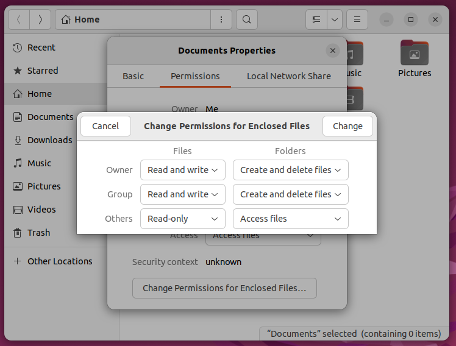

Linuxissa tiedostoilla ja hakemistoilla on kullakin omat käyttöoikeudet. Kaikilla Linuxin tiedostoilla on kolmeosainen access control, joka määrää pääsyn kolmella dimensiolla: omistaja (esim. käyttäjä `opettaja`), ryhmä (esim. `sales` tai useammin sama kuin käyttäjä eli `opettaja`), sekä kaikki loput järjestelmään kirjautuneet käyttäjät eli others.

Jokaiselle näistä kolmesta, eli `(owner)(group)(others)`, määräytyy pääsynhallinta kolmen bitin avulla. Näiden tarkat verbit riippuvat siitä, onko kyseessä ==tiedosto vai hakemisto==. Mikäli kyseessä on tiedosto, niin verbit ovat vasemmalta lukien järjestyksessä **read**,  **write** ja **execute**.  Esimerkiksi ownerin pääsy voi olla jotain välillä `000`...`111`. Kurkataan välissä, miltä tämä näyttää GNOME:n tiedostoselaimessa eli Nautiluksessa (ks. Kuvio 1).




**Kuvio 1:** *GNOME 3:n vakio tiedostoselaimessa (GNOME Nautilus 42.6) voi asettaa hakemiston ja sen sisältämien tiedostojen sekä hakemistojen käyttöoikeudet rekursiivisesti.*


## Samat numeroina

Käännetään kuvassa näkyvä tiedostojen pääsyhallinta luvuiksi. Katso alla oleva taulukko.

|               | Selite         | Binääri | Desimaali |
| ------------- | -------------- | ------- | --------- |
| Owner can...  | Read and write | 110     | 6         |
| Group can...  | Read and write | 110     | 6         |
| Others can... | Read           | 100     | 4         |

Huomaa, että selitteen verbit vaihtuvat sen mukaan, onko kyseessä tiedosto vai hakemisto. Verbit ovat selitettynä alla taulukossa. Linuxissa ohjelmat tunnistetaan siitä, että jokin kolmesta permissionista on muotoa `xx1`, kun taas Windowsissa suoritettavat ohjelmat tunnistetaan yleisesti tiedostopäätteestä (`.exe`).

|      | Tiedosto kohdalla entiteetti...                              | Hakemiston kohdalla....                                      |
| ---- | ------------------------------------------------------------ | ------------------------------------------------------------ |
| 100  | Saa lukea sisällön                                           | Saa listata mitä tiedostoja ja alihakemistoja se sisältää.   |
| 010  | Saa kirjoittaa tiedostoon tai poistaa tiedoston.             | Saa lisätä ja poistaa tiedostoja sekä alihakemistoja.        |
| 001  | Saa suorittaa tiedoston. Tiedosto on nyt `executable` eli ohjelma. | Saa suorittaa ohjelmia hakemiston sisällä, listata tiedostojen metadataa, vaihtaa `pwd`:n kyseiseksi kansioksi. |

Käymme Linuxin komennot myöhemmin läpi, mutta voit alustavasti jo miettiä, mitä alla näkyvät komennot tekevät. Komentojen välissä oleva `&&` on looginen AND-operaattori, mikä aiheuttaa sen, että jälkimmäinen komento ajetaan vain jos ensimmäinen ei nostanut varoituksia. Muutoin komennot tekevät hyvinkin sen, miltä ne englanniksi kuulostavat.

```bash
$ echo "This is my file" > myfile   # Merkkijono ammutaan uuteen tiedostoon
$ ls -la myfile
-rw-rw-r-- 1 opettaja opettaja 16 elo    30 13:09 myfile

$ cat myfile    # Tulostetaan tiedoston sisältö
This is my file

$ chmod 777 myfile && ls -la myfile
-rwxrwxrwx 1 opettaja opettaja 16 elo    30 13:09 myfile

$ chmod -x myfile && ls -la myfile
-rw-rw-rw- 1 opettaja opettaja 16 elo    30 13:09 myfile

$ chmod +r myfile && ls -la myfile
-rw-rw-rw- 1 opettaja opettaja 16 elo    30 13:09 myfile

$ chmod 000 myfile && ls -la myfile
---------- 1 opettaja opettaja 16 elo    30 13:09 myfile

$ cat myfile    # Tulostetaan tiedoston sisältö
cat: myfile: Permission denied

$ chmod u+rw && ls -la myfile
-rw------- 1 opettaja opettaja 16 elo    30 13:09 myfile

$ chmod g+r,o+r myfile && ls -la myfile
-rw-r--r-- 1 opettaja opettaja 16 elo    30 13:09 myfile
```


## Entäpä hakemistot?

Hakemiston erottaa tiedostosta Linuxissa siten, että `ls -la` komennon output alkaa d-kirjaimella, kuten `drwx------`. Hakemistolle annettu hassu oikeus saattaa myöhemmin aiheuttaa päänvaivaa, kun pohdit mikset saa muokata jotain aiemmin luotua tiedostoa.

```sh
$ mkdir my                             # Luo kansio
$ touch my/tralalaa my/dingdingdong    # ja sinne kaksi tiedostoa
$ mkdir my/inner                       # Luo myös alikansio
$ touch my/inner/peace                 # ja sinnekin tiedosto
$ tree my                              # Näytä hakemistopuu
my
├── dingdingdong
├── inner
│   └── peace
└── tralalaa

$ chmod 666                            # Anna muut paitsi execute kaikille
$ touch my/soul
touch: cannot touch 'my/soul': Permission denied

$ cat my/inner/peace
cat: my/inner/piece: Permission denied

$ ls -la | grep my                     # Kansion itsensä voi listata
drw-rw-rw-  2 opettaja opettaja 4096 elo    30 15:51 my

$ rm -rf my/                           # Yritä poistaa
rm: cannot remove 'my/dingdingdong': Permission denied
rm: cannot remove 'my/tralalaa': Permission denied

$ chmod u+x my                         # Anna execute ownerille
$ rm -rf my                            # Nyt kansion ja tiedostot voi poistaa
```


