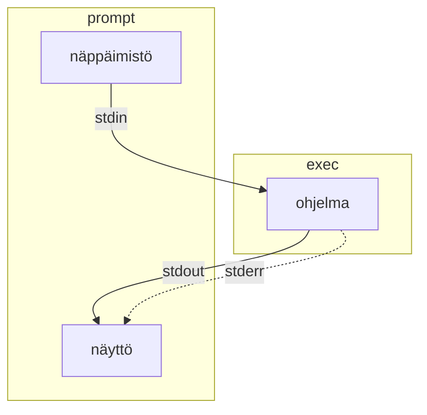
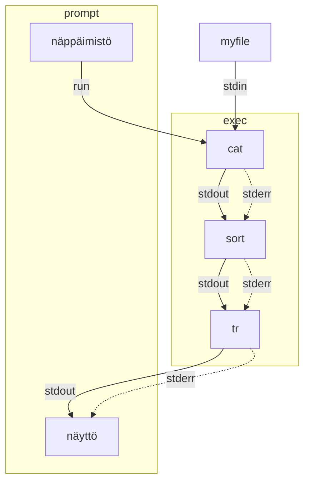

Tyypillinen ohjelma ottaa syötteensä näppäimistöltä tai tiedostosta ja tulostaa palautuvan virran näytölle. Tähän työhön osallistuu kolme eri standardivirtaa:  standardisyöte (**stdin**), standardituloste (**stdout**) ja standardivirhe (**stderr**). Näitä striimejä edustavat luvut 0, 1 ja 2 samassa järjestyksessä.




## Uudelleenohjaus

Standardivirtaa voi uudelleenohjata tiedostoihin tai tiedostoista. Kohdetiedosto luodaan jos sitä ei ole olemassa.

| Operaattori  |                                                                                                                                                            |
| ------------ | ---------------------------------------------------------------------------------------------------------------------------------------------------------- |
| `>` tai `1>` | Ohjaa stdoutin tiedostoon.                                                                                                                                 |
| `2>`         | Ohjaa stderrorin tiedostoon                                                                                                                                |
| `&>`         | Ohjaa kummatkin tiedostoon                                                                                                                                 |
| `>>`         | Tekee saman kuin mikä tahansa aiempi `>`, mutta ei kirjoita tiedostoa alusta alkaen vaan jatkaa (eng. append) tiedostoa.                                   |
| `<`          | Tuo stdinputin tiedostosta. Tällöin syntaksi olisi `command < input.txt > output.txt`, mikä on tosin useimmiten sama kuin `command input.txt > output.txt` |
| 2>&1         | Hieman outolintu, joka ohjaa stderrorin sisällön stdoutputtiin. Stdoutput sisältää jatkossa kummatkin.                                                     |

Käytännössä tämä mahdollista muun muassa komennon ajamisen siten, että onnistunut output kirjoitetaan yhteen tiedostoon, errorit toiseen:

```
somecommand > success.output 2> errors.log
```


## Putket

Standardivirran voi myöhemmin päättää putkittaa (`piping`) käyttäen putkisymbolia (`|`) seuraavalle ohjelmalle. Linux-komentoihin tutustutaan myöhemmin syvemmin, mutta tarkkaile mitä alla oleva liuta komentoja tekee:

```sh
$ echo "c" > myfile   # Ylikirjoita
$ echo "b" >> myfile  # Jatka
$ echo "a" >> myfile  # Jatka
$ cat myfile          # Tulosta
c
b
a

$ cat myfile | sort | tr [:lower:] [:upper:] # Järjestä ja kapitalisoi
A
B
C
```

Yllä oleva esimerkki ajaa komennon `cat`, jonka standard output siirtyy `sort` ohjelman inputiksi, jonka standard output siirtyy `tr`-ohjelman inputiksi, ja lopulta sen tuloste palautuu takaisin käyttäjälle. Lopputuloksena on alkuperäinen syöte aakkosjärjestyksessä, kirjaimet vaihdettuna suuriin kirjaimiin. Lisää esimerkkejä löytyy suomeksi täältä: [Standardivirrat – Linux.fi](https://www.linux.fi/wiki/Standardivirrat).

Alla sama graafisena:




## Näppärät pikanäppäimet

| Klikattavat näppäimet             | Toiminto                                                                                  |
| --------------------------------- | ----------------------------------------------------------------------------------------- |
| ++ctrl+l++                        | Tyhjentää ruudun. Sama kuin komento `clear`.                                              |
| ++tab++                           | Automaattinen täydennys. Tunnistaa sekä kansion tiedostoja että PATH:ssa olevia ohjelmia. |
| ++tab+tab++                       | Tuplaklikkaus. Automaattinen täydennys, joka näyttää useammat vaihtoehdot.                |
| ++ctrl+u++                        | Poistaa kaikki merkit kirjaisimesta vasemmalle. Näppärä tapa tyhjentää rivi plöröstä.     |
| ++up++<br /> ++down++             | Historian kelaaminen. Voit plärät vanhoja komentoja.                                      |
| ++ctrl+left++<br />++ctrl+right++ | Sanojen hyppiminen vasemmalle ja oikealle. Myös ++alt+b++ ja ++alt+f++ tekevät saman.     |


## Vaarallisemmat pikanäppäimet

| Pikanäppäin | Toiminto                                                                                                                                                                                                                                      |
| ----------- | --------------------------------------------------------------------------------------------------------------------------------------------------------------------------------------------------------------------------------------------- |
| ++ctrl+d++  | Virallisesti EOF. Sillä pääsee esimerkiksi `cat`-sovelluksesta ulos, mutta `bash`:ssä käytettynä se on sama kuin kirjoittaisi `exit`.                                                                                                         |
| ++ctrl+c++  | Interrupt-signaali (SIGINT). Lopettaa ohjelman, millä voi pyrkiä tappamaan jumiin jääneen sovelluksen.                                                                                                                                        |
| ++ctrl+z++  | Pysäyttää sovelluksen ja siirtää sen taka-alalle. Ohjelman toistoa voi jatkaa komennolla `fg`. Vaihtoehtoisesti sen voi käydä myöhemmin tappamassa `kill`-komennolla, mikäli se oli jumissa, eikä siitä pääse eroon yllä olevalla SIGINT:llä. |

## Here document

Here document on tapa syöttää useita rivejä komentoriville. Tämä on hyödyllistä esimerkiksi silloin, kun haluat luoda tiedoston sisällön komentoriviltä. Tämä onnistuu esimerkiksi seuraavasti:

```sh
$ cat > tiedosto.txt << EOF
> Tämä on ensimmäinen rivi.
> Tämä on toinen rivi.
> EOF
```

Lue aiheesta lisää esimerkiksi [Wikipedia: Here document](https://en.wikipedia.org/wiki/Here_document).