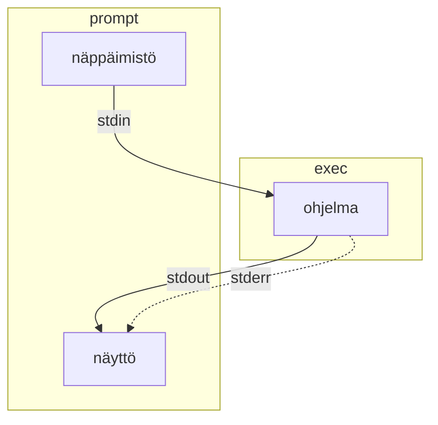
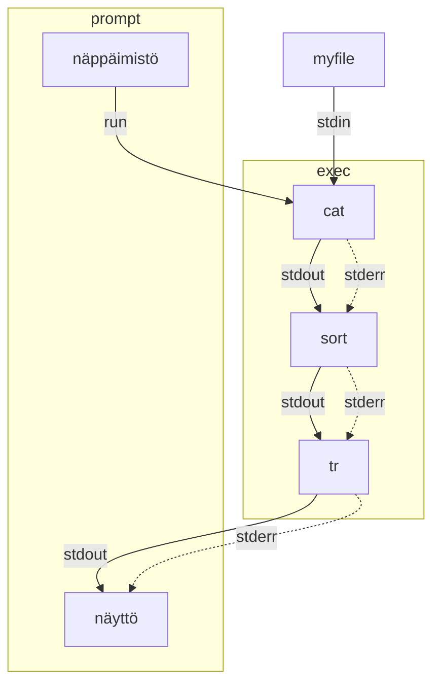

Linuxia voi käyttää usealla eri käyttöliittymällä. Termistö tulee yllättävänkin kaukaa historiasta, lue koko tarina täältä: [A Guide to the Terminal, Console, and Shell (thevaluable.dev)](https://thevaluable.dev/guide-terminal-shell-console/). Alla sama aihe lyhyemmin suomeksi. 

Kaukokirjoitin (eng. teleprinter), suurimpana valmistaja **t**ele**ty**pe (`=> tty`), oli fyysinen laite, joka koostui näppäimistöstä ja tulostimesta, ja joka lähetti viestin vastaanottajalle esimerkiksi puhelinlankoja pitkin. Viesti tulostettiin paperille. Näitä käytettiin ==jo 1800-luvun lopulla==. Myöhemmin, tietokoneiden aikakaudella eli 1900-luvun puolivälin tienoilla, kaukokirjoittimia (`muista: tty`) käytettiin lähettämään viestejä keskustietokoneisiin (eng. mainframe).

1960-luvulla tulostaminen korvattiin näytöillä, ja näin syntyi videoterminaali, josta käytettiin myös termiä `console` tai lyhyesti `terminal`.

1970-luvulla kaukokirjoittimella tai terminaalilla pystyi lähettämään viestejä UNIX-käyttöjärjestelmään. Lähetetyt viestit kirjoitettiin `/dev/tty0` (tai `tty1` - `tty63`) tiedostoon. Jokaista lähettäjää varten oli oma, juoksevalla numerolla numeroitu tiedosto. Tämä tiedosto toimi rajapintana UNIX:n pään ohjelmille, jotka pystyivät käsittelemään tätä tiedostoa (tai laitetta) tavallisella ASCII-merkistöllä.

Ohjelma, joka tulkitsee `dev/tty`:n sisältöä, on shell. Alunperin tämä oli UNIX-järjestelmissä `Bourne shell`, mutta avoimen lähdekoodin GNU/Linuxissa se on yleisimmin **Bash** (`Bourne-again shell`). UNIX-tyylisissä järjestelmissä komentirivipohjainen shell on jossain määrin myös ohjelmointikieli, ja se toteuttaa tietyt built-in ohjelmat kuten `cd`, `break`, `continue`, `exec` ja `kill`, kuten [GNU Bashin oma dokumentaatio](https://www.gnu.org/software/bash/manual/html_node/What-is-a-shell_003f.html) kertoo.  Kotitietokoneet alkoivat yleistyä, ja kotitietokoneen kanssa fyysisesti erillinen konsoli eli terminaali ei ole tarpeen, joten se emuloitiin (`terminal emulator`). Näistä emuloiduista terminaaleista käytetään yhä termiä `TTY device`. Komentoja tulkkaava shell, kuten `bash`, lukee tämän virtuaalisen konsolin syötettä `/dev/tty`-tiedostosta.

| Termi                    | Määritelmä                                                   |
| ------------------------ | ------------------------------------------------------------ |
| Shell                    | Ohjelma, joka toimii ihmiselle käyttöliittymänä. Mikäli käytät GNOME 3 -työpöytäympäristöä, sinun shell on [GNOME Shell](https://access.redhat.com/documentation/en-us/red_hat_enterprise_linux/7/html/desktop_migration_and_administration_guide/gnome-shell). Mikäli kirjaudut Linuxiin ilman graafista shelliä, sinun shell on todennäköisimmin [GNU Bash](https://www.gnu.org/software/bash/). |
| Komentotulkki            | Englanniksi command language interpreter tai command-line interface, lyhenteeltään CLI. GNU Bash on sekä shell että CLI. |
| Graafinen käyttöliittymä | Englanniksi graphical user interface, lyhenteeltään GUI. GNOME Shell on sekä shell että GUI. |
| Terminaali               | Terminaali on kone - tai yleisemmin virtuaaliterminaali eli ohjelma - jossa shell ajetaan. Konsoli on käytännössä sama asia. |
| Pseudoterminaali         | Ohjelma, jota käyttäjä ajaa graafisessa käyttöliittymässä, ja joka emuloi terminaalia. Käytät pseudoterminaalia, kun olet graafisessa käyttöliittymässä ja etsit jostakin kuvakkeen "Terminal". |


## Virtuaaliterminaalit

Mikäli olet kirjautunut virtuaaliterminaaliin (++ctrl+alt+f3++), voit tarkistaa mihin virtuaaliterminaaliin shelli on kiinnittynyt:

```sh
$ tty
/dev/tty3

$ echo $TERM
linux
```


## Pseudoterminaalit

Jos ajat saman komennnon työpöytäympäristön terminaalissa (++ctrl+alt+t++), eli esimerkiksi ohjelmassa nimeltään `gnome-terminal`, saat erilaisen tuloksen. Tämä johtuu siitä, että työpöytä itsessään on shell (esim. `GNOME Shell`) ja käyttää `tty`:tä konepellin alla.

```sh
$ tty
/dev/pts/0

$ echo $TERM
xterm-256color
```


## Peruskäyttö

Huomaa, että käyttämäsi shell voi olla jokin muu kuin bash. Voit selvittää yleensä jollain seuraavista komennoista. Komennon käyttö on simppeliä: kirjoita se ja paina ++enter++.

```sh
$ echo $0
bash

$ echo $SHELL
/bin/bash

$ cat /etc/passwd | grep opettaja  # Korvaa omalla käyttäjänimellä
opettaja:x:1000:1000:Ope Opettaja,,,:/home/opettaja:/bin/bash
```

Bashin käyttöohjeen löydät joko distribuution sivuilta [Ubuntu Manpage: bash - GNU Bourne-Again SHell](https://manpages.ubuntu.com/manpages/jammy/man1/bash.1.html) tai komennolla:

```bash
$ man 1 bash # Bashin manuaali (1)
...

$ man man    # Manuaalin manuaali
...
```

1. Komento `man` avaa ohjeet pitkiä tekstitiedostoja sivuttavassa ohjelmassa nimeltään `pager`. Lue ohjeet ohjelman tulosteen eli ruudun alalaidasta. 


## Standardivirrat

Tyypillinen ohjelma ottaa syötteensä näppäimistöltä ja tulostaa palautuvan virran näytölle. Tähän työhön osallistuu kolme eri standardivirtaa:  standardisyöte (**stdin**), standardituloste (**stdout**) ja standardivirhe (**stderr**). Näitä striimejä edustavat luvut 0, 1 ja 2 sanassa järjestyksessä.




## Uudelleenohjaus

Standardivirtaa voi uudelleenohjata tiedostoihin tai tiedostoista. Kohdetiedosto luodaan jos sitä ei ole olemassa.

| Operaattori  |                                                              |
| ------------ | ------------------------------------------------------------ |
| `>` tai `1>` | Ohjaa stdoutin tiedostoon.                                   |
| `2>`         | Ohjaa stderrorin tiedostoon                                  |
| `&>`         | Ohjaa kummatkin tiedostoon                                   |
| `>>`         | Tekee saman kuin mikä tahansa aiempi `>`, mutta ei kirjoita tiedostoa alusta alkaen vaan jatkaa (eng. append) tiedostoa. |
| `<`          | Tuo stdinputin tiedostosta. Tällöin syntaksi olisi `command < input.txt > output.txt`, mikä on tosin useimmiten sama kuin `command input.txt > output.txt` |
| 2>&1         | Hieman outolintu, joka ohjaa stderrorin sisällön stdoutputtiin. Stdoutput sisältää jatkossa kummatkin. |

Käytännössä tämä mahdollista muun muassa komennon ajamisen siten, että onnistunut output kirjoitetaan yhteen tiedostoon, errorit toiseen:

```
somecommand > success.output 2> errors.log
```


## Putket

Standardivirran voi myöhemmin päättää putkittaa (`piping`) käyttäen putkisymbolia (`|`) seuraavalle ohjelmalle. Linux-komentoihin tutustutaan myöhemmin syvemmin, mutta tarkkaile mitä alla oleva liuta komentoja tekee:

```sh
$ echo "c" > myfile   # Ylikirjoita
$ echo "b" >> myfile  # Jatka
$ echo "a" >> myfile  # Jatka
$ cat myfile          # Tulosta
c
b
a

$ cat myfile | sort | tr [:lower:] [:upper:] # Järjestä ja kapitalisoi
A
B
C
```

Yllä oleva esimerkki ajaa komennon `cat`, jonka standard output siirtyy `sort` ohjelman inputiksi, jonka standard output siirtyy `tr`-ohjelman inputiksi, ja lopulta sen tuloste palautuu takaisin käyttäjälle. Lopputuloksena on alkuperäinen syöte aakkosjärjestyksessä, kirjaimet vaihdettuna suuriin kirjaimiin. Lisää esimerkkejä löytyy suomeksi täältä: [Standardivirrat – Linux.fi](https://www.linux.fi/wiki/Standardivirrat).

Alla sama graafisena:




## Näppärät pikanäppäimet

| Klikattavat näppäimet             | Toiminto                                                     |
| --------------------------------- | ------------------------------------------------------------ |
| ++ctrl+l++                        | Tyhjentää ruudun. Sama kuin komento `clear`.                 |
| ++tab++                           | Automaattinen täydennys. Tunnistaa sekä kansion tiedostoja että PATH:ssa olevia ohjelmia. |
| ++tab+tab++                       | Tuplaklikkaus. Automaattinen täydennys, joka näyttää useammat vaihtoehdot. |
| ++ctrl+u++                        | Poistaa kaikki merkit kirjaisimesta vasemmalle. Näppärä tapa tyhjentää rivi plöröstä. |
| ++up++<br /> ++down++             | Historian kelaaminen. Voit plärät vanhoja komentoja.         |
| ++ctrl+left++<br />++ctrl+right++ | Sanojen hyppiminen vasemmalle ja oikealle. Myös ++alt+b++ ja ++alt+f++ tekevät saman. |


## Vaarallisemmat pikanäppäimet

| Pikanäppäin | Toiminto                                                     |
| ----------- | ------------------------------------------------------------ |
| ++ctrl+d++  | Virallisesti EOF. Sillä pääsee esimerkiksi `cat`-sovelluksesta ulos, mutta `bash`:ssä käytettynä se on sama kuin kirjoittaisi `exit`. |
| ++ctrl+c++  | Interrupt-signaali (SIGINT). Lopettaa ohjelman, millä voi pyrkiä tappamaan jumiin jääneen sovelluksen. |
| ++ctrl+z++  | Pysäyttää sovelluksen ja siirtää sen taka-alalle. Ohjelman toistoa voi jatkaa komennolla `fg`. Vaihtoehtoisesti sen voi käydä myöhemmin tappamassa `kill`-komennolla, mikäli se oli jumissa, eikä siitä pääse eroon yllä olevalla SIGINT:llä. |
