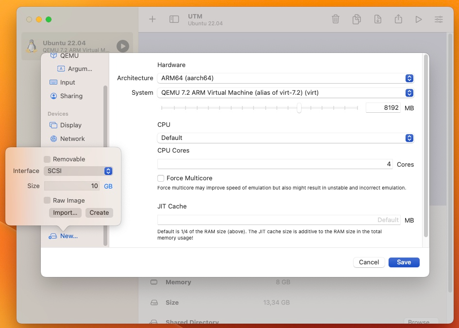

Tietokoneessa käynnissä olevat ohjelmat eli prosessit ovat ladattuina tietokoneen keskusmuistiin (RAM). Jotta jotakin tietoa voisi säilyttää (eng. persist) pysyvästi, tarvitaan massamuistina toimiva laite, kuten kiintolevy tai SSD-puolijohdelevy. Virtuaalikoneessasi tämä laite on virtuaalinen, mutta löytyy `/dev`-lokaatiosta tiedostona, kuten muutkin laitteet Linuxissa.

Alla esimerkki macOS:n UTM-virtuaalikoneessa ajetusta Ubuntusta, josta löytyy seuraavat block devicesit (ks. `man lsblk`).

```bash
$ lsblk --exlude 7
NAME   MAJ:MIN RM  SIZE RO TYPE MOUNTPOINTS
sr0     11:0    1 1024M  0 rom  
vda    252:0    0   64G  0 disk 
├─vda1 252:1    0  512M  0 part /boot/efi
└─vda2 252:2    0 63,5G  0 part /
```

Mikäli sinulla on virtuaalikone Windowsissa, laitteena on todennäköisesti `sda` eikä `vda`. SDA on hypervisorin emuloima SCSI-asema, kun taas VDA on paravirtualisoitu, jolloin virtuaalikoneen käskyt viedään jotakuinkin läpivientinä hypervisorin läpi sen alla olevaan käyttöjärjestelmään, joka on tässä tapauksessa UNIX-pohjainen macOS.

P.S. Listalla voi näkyä muutakin kuin, kuten Firefoxin `host-hunspell`. 


## Laitteet

Mikäli haluat löytää laitteista lisää tietoa, voit tarkistaa esimerkiksi kernel ring bufferin eli kernelin lokiviestit (komento `sudo dmesg`) tai udevin eli laitehallinnan tietoja. Alla jälkimmäisen output kyseisten laitteiden kohdalta.

```bash
# udev
$ udevadm info /dev/sr0
P: /devices/pci0000:00/0000:00:04.0/usb1/1-4/1-4.1/1-4.1:1.0/host0/target0:0:0/0:0:0:0/block/sr0
N: sr0
L: -100
S: cdrom
S: disk/by-id/usb-QEMU_QEMU_CD-ROM_1-0000:00:04.0-4.1-0:0
...

# udev
$ udevadm info /dev/vda
P: /devices/pci0000:00/0000:00:06.0/virtio2/block/vda
N: vda
L: 0
S: disk/by-path/virtio-pci-0000:00:06.0
S: disk/by-path/pci-0000:00:06.0
...
```


Huomaa, että laitteet ovat tässä tapauksessa vain virtuaalisia. Tiedostojen lokaatio ja muoto riippuu hypervisorista. Tässä tapauksessa hypervisor on UTM, ja tiedosto löytyy lokaatiosta:

```bash
/Users/<user>/Library/Containers/com.utmapp.UTM/Data/Documents/<vm-name>/Data
```


## SCSI

Mikäli et paravirtualisoi massamuistia virtio:lla kuten yllä, laitteet käsitellään Linuxissa mitä suurimmalla todennäköisyydellä SCSI block device -tyylisinä laitteina. Tämä ei siis tarkoita, että tietokoneessa olisi erikseen SCSI-ohjainkortti, vaan Linux käyttää SCSI-komentoja levyjen kanssa kommunikoimiseen. (S)ATA, ATAPI, USB ja muihin liitäntöihin kiinnitetyt massamuistilaitteet näkyvät täten Linuxissa SCSI-väylään kytkettyinä laitteina.



**Kuvio 1**: *Virtuaalikoneeseen lisätään uusi SCSI-rajapintaa käyttävä levy.*

Mikäli virtuaalikoneeseen lisätään kaksi SCSI-rajapintaa käyttävää levyä, ja ajetaan aiemmin tuttu list block devices komento, tulostuu ruudulle alla näkyvä tuloste. Mikäli `--exclude`:n viittaamaa sekä tulostuneessa taulussa näkymä MAJ eli major numero kiinnostaa, tutki tiedostoa `/proc/devices`, jossa ne ovat listattuina.

```bash
$ lsblk --exlude 7
NAME   MAJ:MIN RM  SIZE RO TYPE MOUNTPOINTS
sda      8:0    0   10G  0 disk 
sdb      8:16   0   10G  0 disk 
sr0     11:0    1 1024M  0 rom  
vda    252:0    0   64G  0 disk 
├─vda1 252:1    0  512M  0 part /boot/efi
└─vda2 252:2    0 63,5G  0 part /
```

Kuten yllä näkyy, kaksi uutta SCSI-laitetta ovat saaneet nimet `sda` ja `sdb`. Linux näkee siis laitteet, mutta niitä ei ole vielä liitetty millään tavalla file hierarchyyn. Tietokoneessa vapaana oleva kiintolevytila ei ole siis vielä käyttöjärjestelmän näkökulmasta lisääntynyt. Tämän voi varmistaa ajamalla `df`-komennon. Option `-h` kertoo koot ihmisille sopivissa formaateissa, `-e tmpfs` sen sijaan piilottaa muistinsisäiset eli vain RAM:ssa sijaitsevat, väliaikaiset levyjärjestelmät.

```bash
$ df -h --exclude-type tmpfs
Filesystem      Size  Used Avail Use% Mounted on
/dev/vda2        63G   13G   47G  22% /
/dev/vda1       512M  5,3M  507M   2% /boot/efi
```

Jos haluat nähdä kaikki SCSI-laitteesi listamuodossa, tutustu tiedostoon `/proc/scsi/scsi` tai aja alla näkymä komento:

```bash
$ lsscsi
[0:0:0:0]    disk    QEMU     QEMU HARDDISK    2.5+  /dev/sda 
[0:0:1:0]    disk    QEMU     QEMU HARDDISK    2.5+  /dev/sdb 
[1:0:0:0]    cd/dvd  QEMU     QEMU CD-ROM      2.5+  /dev/sr0 
```

Ensimmäisen sarakkeen selite löytyy `/proc/scsi/scsi`-tiedostosta, eli `[0:0:0:0]` on sama kuin `Host: scsi0 Channel: 00 Id: 00 Lun: 00`.
