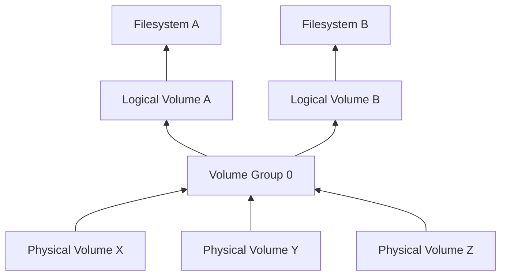

Edellisessä luvussa ([Osiot](osiot.md)) loimme yhden partition levylle `/dev/sda`, mounttasimme sen, lisäsimme sen `fstab`-tiedostoon ja lopulta poistimme osion.

Tässä luvussa otamme käyttöön **Logical Virtual Managerin**:n eli LVM:n, joka muistuttaa jossain määrin Windowsista tuttua Storage Spaces:iä. Kuvittele, että sinulla on edellisessä harjoituksessa luodun osion, joka mountattiin lokaatioon `/mnt/mydata`, levytila lopussa. Huomaat tämän `df -H` komennolla.

!!! quote
    "Haluan lisätä levytilaa /mnt/mydata/ kansion alla olevaan partitioon. Kyseinen osio on /dev/sda1 ja sen on levyn /dev/sda ainut osiot."

Levy on tässä tapauksessa virtuaalinen, joten me voimme skaalata sitä suuremmaksi, mutta enpä jos levy on fyysinen? Vaihehtoja ovat ainakin:

- Osta suurempi kiintolevy ja kopioi data sille. Mounttaa uusi levy vanhan tilalle.
- Osta toinen kiintolevy ja mounttaa se `/mnt/moredata`. Käyttäjä joutuu hallinnoimaan tilan.

LVM ratkaisee muun muassa tämän ongelman: voit kytkeä tietokoneeseen uuden levyn ja luoda siitä fyysisen volumen. Tutustutaan tähän alla.

## Terminologia



| Termi           | Lyhenne | Selite                                                                                                                                                                         |
| --------------- | ------- | ------------------------------------------------------------------------------------------------------------------------------------------------------------------------------ |
| Filesystem      | N/A     | Tämä ei muutu. LVM:ää tukevat kaikki aiemmin mainitut tiedostojärjestelmät, kuten `ext4` sekä `xfs`, koska sen alla oleva Logical Volume on ihan vain tavallinen block device. |
| Logical Volume  | lv      | Loogiset volumet ovat käyttäjän näkökulmasta tavallisia block devicejä, jotka listataan paikassa `/dev/mapper/` symbolisina linkkeinä.                                         |
| Volume Group    | vg      | LVM:n hallinnoimia usean Physical Volumen kokonaisuuksia. Näistä voidaan myöhemmin luoda Logical Volumeja.                                                                     |
| Physical Volume | pv      | Koko kiintolevy tai yksittäinen osio levyllä.                                                                                                                                  |

## Luodaan kahden levyn group

!!! warning
    Ajathan nämä esimerkit vain sinun hallinnoimalla koneella, jolla ei ole mitään tärkeää tallennettuna. Tässä esimerkissä oletetaan, että olet liittänyt koneeseen kaksi kiintolevyä (`/dev/sda` ja `/dev/sdb`), jotka ovat tyhjiä, eivätkä ole missään käytössä. Lue kaksi aiempaa lukua (Levyt ja Osiot) jos et tiedä mistä tässä on kyse.

Aloitetaan asentamalla tarvittavat työkalut:

```bash title="Bash"
# Asenna
$ sudo apt install lvm2

# Yritä listata nykyiset volume groupit
$ sudo vgs
```

Tämän jälkeen alamme luoda LVM:ää graafin pohjalta ylöspäin järjestyksessä PV, VG, LV ja lopuksi tiedostojärjestelmä

### PV

```bash title="Bash"
# HUOM! Jos levy sisältää edellisen harjoituksen pohjalta GPT:n, poista se:
# $ sudo wipefs --all /dev/sda

# Luo physical volume koko levystä
$ sudo pvcreate /dev/sda
  Physical volume "/dev/sda" successfully created.

# Tee sama toiselle levylle
$ sudo pvcreate /dev/sdb
  Physical volume "/dev/sdb" successfully created.

# Listaa
$ sudo pvs
  PV         VG Fmt  Attr PSize  PFree
  /dev/sda      lvm2 ---  10,00g 10,00g
  /dev/sdb      lvm2 ---  10,00g 10,00g

# Tarkastele tarkemmin
$ sudo
  "/dev/sda" is a new physical volume of "10,00 GiB"
  --- NEW Physical volume ---
  PV Name               /dev/sda
  VG Name
  PV Size               10,00 GiB
  Allocatable           NO
  PE Size               0
  Total PE              0
  Free PE               0
  Allocated PE          0
  PV UUID               96qMoT-w2eU-3S3h-VZSo-Qrsp-k96L-7XDqD9

```

### VG

```bash title="Bash"
# Luo
$ sudo vgcreate myvg0 /dev/sda /dev/sdb
  Volume group "myvg0" successfully created

# Listaa
$ sudo vgs
  VG    #PV #LV #SN Attr   VSize  VFree
  myvg0   2   0   0 wz--n- 19,99g 19,99g

# Tarkastele
$ sudo vgdisplay myvg0
  --- Volume group ---
  VG Name               myvg0
  System ID
  Format                lvm2
  ...
  PE Size               4,00 MiB
  Total PE              5118
  Free  PE / Size       5118 / 19,99 GiB
  VG UUID               JEikj0-x8Ue-4Ozp-ev6d-Hdjb-rpGq-814q10
```

PE eli Physical Extent on yksikkö, jonka kokoisiin loogisiin palasiin Volume Group on pilkottu. Logical Volumet luodaan jakamalla näitä eri laareihin.

### LV

```bash title="Bash"
# Luo
$ sudo lvcreate --name mydata --extents 100%FREE myvg0
  Logical volume "mydata" created.

# Listaa
$ sudo lvs
  LV     VG    Attr       LSize  Pool Origin Data%  Meta%  Move Log Cpy%Sync Convert
  mydata myvg0 -wi-a----- 19,99g

$ sudo lvdisplay myvg0
  --- Logical volume ---
  LV Path                /dev/myvg0/mydata
  LV Name                mydata
  VG Name                myvg0
  LV UUID                0dCKxl-QCyg-3xgy-TOuq-0bmR-V0eu-Np8jEF
  LV Write Access        read/write
  LV Creation host, time opettajakone, 2023-09-25 10:29:06 +0300
  LV Status              available
  # open                 0
  LV Size                19,99 GiB
  Current LE             5118
  Segments               2
  Allocation             inherit
  Read ahead sectors     auto
  - currently set to     256
  Block device           253:0
```

Jos katsot nyt, mitä block devicejä sinulla on käytössä, huomaat että sekä sda että sdb ovat tyyppiä LVM. Kummankin osiona näkyy Volume Group myvg0-mydata.

```bash title="Bash"
# Listaa
$ lsblk -e 7 /dev/sda /dev/sdb
NAME           MAJ:MIN RM SIZE RO TYPE MOUNTPOINTS
sda              8:0    0  10G  0 disk
└─myvg0-mydata 253:0    0  20G  0 lvm
sdb              8:16   0  10G  0 disk
└─myvg0-mydata 253:0    0  20G  0 lvm

# Kyseinen osio löytyy paikasta:
$ ls -la /dev/mapper
crw-------  1 root root 10, 236 syys   25 08:44 control
lrwxrwxrwx  1 root root       7 syys   25 10:29 myvg0-mydata -> ../dm-0
```

Huomaat, että `myvg0-mydata` on symbolinen linkki `/dev/dm-0` deviceen.

### Tiedostojärjestelmän luonti

```bash title="Bash"
$ sudo mkfs.ext4 -L MyData /dev/mapper/myvg0-mydata
mke2fs 1.46.5 (30-Dec-2021)
Discarding device blocks: done
Creating filesystem with 5240832 4k blocks and 1310720 inodes
Filesystem UUID: 808c8175-4c78-429d-9dcf-c6c58736fd2b
```

Kun tiedostojärjestelmä on luotu, mountataan osio kuten aiemminkin:

```bash title="Bash"
# Mount
$ sudo mount /dev/mapper/myvg0-mydata /mnt/mydata/

# Tarkista
$ mount | grep myvg
/dev/mapper/myvg0-mydata on /mnt/mydata type ext4 (rw,relatime)

# Muuta oikeuksia tarpeen mukaan, kuten
# $ sudo chown opettaja:opettaja /mnt/mydata
```

Mikäli haluat, että levy on joka bootissa käytössä, lisää se tuttuun tapaan fstabiin, esimerkiksi alla näkyvällä tavalla. Tiedoston muut rivit on poistettu alla olevasta näkymästä, jotta se pysyy tiiviinä; ethän oikeasti tyhjennä tiedostosta muita rivejä! Myös UUID on lyhennetty luettavuuden parantamiseksi.

```
UUID=<uuid-poistettu>         /               ext4    errors=remount-ro 0       1
/dev/mapper/myvg0-mydata      /mnt/mydata     ext4    defaults          0       2
```

Jos ihmettelet, miksei LVM:n kohdalla käytetä UUID:tä vaan mapper deviceä, niin lue [Best Practice for Mounting an LVM Logical Volume with /etc/fstab](https://xan.manning.io/2017/05/29/best-practice-for-mounting-an-lvm-logical-volume-with-etc-fstab.html).

!!! tip

    Kannattaa kokeilla lisätä myös kolmas levy, poistaa levyjä, ja poistaa koko LVM. Tämän ohjeen jälkeen sinun pitäisi osata tehdä nämä kaikki - tai vähintään etsiä tietoa, kuinka nämä tehdään.
